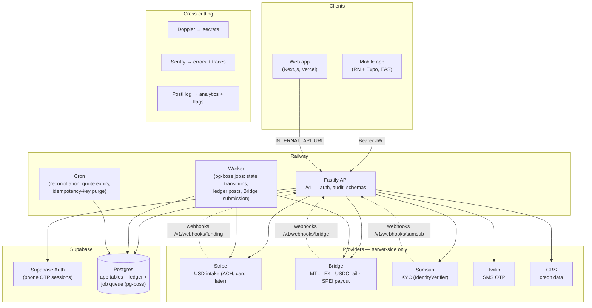

# System Architecture — Puente

**Date:** 2026-07-10
**Status:** v1
**Pairs with:** `erd.md`, `transfer-state-machine.md`, `ledger-rules.md`, `api-contract.md`, `flows.md`

One picture of every runtime component and who talks to whom. The rule that shapes everything:
**clients never touch external providers or the database directly — the Fastify API is the only
boundary.** That keeps secrets server-side, makes providers swappable, and gives every money-touching
call one choke point for auth, audit, and idempotency.

## Diagram



Dotted lines are inbound webhooks (signature-verified, public routes, idempotent). Doppler, Sentry,
and PostHog attach to every service and are omitted from the edge list for readability.

## Components

| Component | Runs on | Role |
|---|---|---|
| Mobile app | Expo EAS | The product surface. NativeWind, expo-router, i18next (EN+ES). Talks only to the API with a Supabase session JWT. |
| Web app | Vercel | Waitlist, credit check, content, KYC hosted flows. No direct Supabase access — all writes via `INTERNAL_API_URL` to the API. |
| Fastify API | Railway | The boundary. `/v1` routes with schema validation, auth middleware (default-on), audit log, rate limiting (`TRUST_PROXY_HOPS=1`). Uses the Supabase service role (RLS is defense-in-depth behind it). |
| Worker | Railway | Executes state-machine transitions from the Postgres job queue (pg-boss): the `FUNDED → SUBMITTED` gate + float-ceiling check, Bridge submission with idempotency keys, ledger posting, refunds. |
| Cron | Railway | Daily reconciliation (ledger vs Stripe vs Bridge), stale-`PENDING_PAYMENT` sweep (30-min no-webhook → `PAYMENT_FAILED`), quote expiry, idempotency-key purge. |
| Postgres (Supabase) | Supabase (staging + prod projects) | App tables, double-entry ledger, and job queue (pg-boss) in **one database**. Jobs are enqueued after the state change commits and are idempotent; a 1-min sweep re-enqueues anything lost (enqueue-after-commit, not a transactional outbox — decisions.md 2026-07-20). RLS enabled everywhere, deny-by-default. |
| Supabase Auth | Supabase | Phone OTP (Twilio SMS) → JWT sessions; 30-day rolling refresh. |

## Provider seams (all behind interfaces)

| Seam | Provider today | Interface | Never from client |
|---|---|---|---|
| USD intake | Stripe | `FundingProcessor` | ✓ |
| Remittance rail / FX / payout | Bridge (holds MTLs) | Bridge service (`apps/api/src/services/bridge.ts`) | ✓ |
| KYC | Sumsub → Bridge handoff | `IdentityVerifier` | ✓ |
| SMS | Twilio (via Supabase Auth) | — | ✓ |
| Credit data | CRS | CRS service | ✓ (FCRA: only after `fcraConsentAt`) |

## Money flow (USD → MXN)

```
Sender ──Stripe (ACH debit)──▶ Puente Stripe balance ──replenish──▶ Bridge treasury wallet (USDC)
                                                                            │ payout (per transfer)
                                                                            ▼
                                                        SPEI ──▶ recipient CLABE (MXN, seconds)
```

Puente never custodies MXN; the ledger is USD-only (see `ledger-rules.md`). **Open question** (ERD):
whether each Puente transfer maps to one Bridge transfer (Bridge orchestrates USD→USDC→MXN
internally) or to a payout leg from a pre-funded treasury wallet plus batch replenishment — resolve
in sandbox before building the worker.

## Environments & deploys

Covered in `CLAUDE.md` (Environments + CI sections): `main` auto-deploys to staging; production is a
deliberate promote (tag/dispatch) that applies migrations to staging first, then prod. Secrets live
in Doppler, synced to Railway / Vercel / GitHub Actions / EAS. Preview PRs point at staging API + DB.
