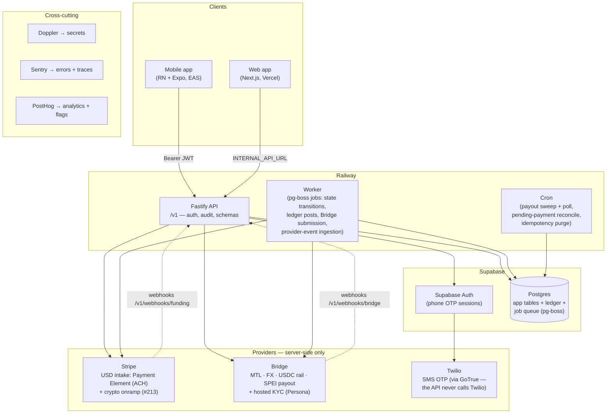

# System Architecture — Puente

**Date:** 2026-07-10 · **Updated:** 2026-08-26 (de-stale pass: Bridge-hosted KYC, no Sumsub/CRS
integration exists, mobile styling correction, onramp rail, current cron roster)
**Status:** current through funding-ops slices 1–4 + the Stripe onramp rail
**Pairs with:** `erd.md`, `transfer-state-machine.md`, `ledger-rules.md`, `api-contract.md`, `flows.md`

One picture of every runtime component and who talks to whom. The rule that shapes everything:
**clients never touch external providers or the database directly — the Fastify API is the only
boundary.** That keeps secrets server-side, makes providers swappable, and gives every money-touching
call one choke point for auth, audit, and idempotency.

## Diagram


```mermaid
flowchart TB
    subgraph clients [Clients]
        mobile["Mobile app<br/>(RN + Expo, EAS)"]
        web["Web app<br/>(Next.js, Vercel)"]
    end

    subgraph railway [Railway]
        api["Fastify API<br/>/v1 — auth, audit, schemas"]
        worker["Worker<br/>(pg-boss jobs: state transitions,<br/>ledger posts, Bridge submission,<br/>provider-event ingestion)"]
        cron["Cron<br/>(payout sweep + poll,<br/>pending-payment reconcile,<br/>idempotency purge)"]
    end

    subgraph supabase [Supabase]
        auth["Supabase Auth<br/>(phone OTP sessions)"]
        pg[("Postgres<br/>app tables + ledger +<br/>job queue (pg-boss)")]
    end

    subgraph providers [Providers — server-side only]
        stripe["Stripe<br/>USD intake: Payment Element (ACH)<br/>+ crypto onramp (#213)"]
        bridge["Bridge<br/>MTL · FX · USDC rail · SPEI payout<br/>+ hosted KYC (Persona)"]
        twilio["Twilio<br/>SMS OTP (via GoTrue —<br/>the API never calls Twilio)"]
    end

    subgraph observability [Cross-cutting]
        doppler["Doppler → secrets"]
        sentry["Sentry → errors + traces"]
        posthog["PostHog → analytics + flags"]
    end

    mobile -->|Bearer JWT| api
    web -->|INTERNAL_API_URL| api
    api --> auth
    api --> pg
    worker --> pg
    cron --> pg
    api & worker --> stripe
    api & worker --> bridge
    auth --> twilio
    stripe -.->|webhooks /v1/webhooks/funding| api
    bridge -.->|webhooks /v1/webhooks/bridge| api
```

Dotted lines are inbound webhooks (signature-verified, public routes, idempotent). Doppler, Sentry,
and PostHog attach to every service and are omitted from the edge list for readability.

## Components

| Component | Runs on | Role |
|---|---|---|
| Mobile app | Expo EAS (SDK 57) | Parity surface (M1–M4 of 9 slices). `StyleSheet` over `@puente/shared/theme` tokens — **NativeWind was evaluated and rejected 2026-08-10** (peer-dep on reanimated); expo-router; shared `@puente/shared/i18n` strings (EN+ES). Talks only to the API with a Supabase session JWT. |
| Web app | Vercel | Public site + waitlist, onboarding (profile → Bridge-hosted KYC), and the dashboard (send incl. the pay step with Stripe Payment Element / onramp widget, transfers, recipients, ops). No direct Supabase access — all writes via `INTERNAL_API_URL` to the API. |
| Fastify API | Railway | The boundary. `/v1` routes with schema validation, auth middleware (default-on), audit log, rate limiting (`TRUST_PROXY_HOPS=1`). Uses the Supabase service role (RLS is defense-in-depth behind it). |
| Worker | Railway | Executes state-machine transitions from the Postgres job queue (pg-boss): the `FUNDED → SUBMITTED` gate + float-ceiling check, Bridge submission with idempotency keys, ledger posting, provider-event ingestion (`payment-event.process`, webhook + poll), and a polling reconciliation backstop for missed webhooks. |
| Cron | Railway | Scheduled in the worker process (nine): `payout.sweep` (1-min, re-enqueues lost/stale submits), `payout.poll` (5-min Bridge reconciliation backstop, derived from `WORKER_POLL_INTERVAL_SECONDS`), `transfer.reconcile-pending` (5-min; stale `PENDING_PAYMENT` → `PAYMENT_FAILED`), `transfers.stuck-watch` (5-min), `worker.heartbeat` (5-min; the ONLY Sentry-cron-monitored job — ~17 min of dead dispatch opens an issue), `ledger.correction-watch` (hourly; rolling Reg E correction-loss sum → `loss-correction-threshold` page), `ledger.reconcile` (**every 6h** since #206 — real money moves out-of-band, so book-vs-provider drift must surface within hours), `idempotency.purge` + `otp.attempts.purge` (daily 04:00). Event-driven queues (not cron): `payout.submit`, `payment-event.process`, `funding.onramp_prepare`. |
| Postgres (Supabase) | Supabase (staging + prod projects) | App tables, double-entry ledger, and job queue (pg-boss) in **one database**. Jobs are enqueued after the state change commits and are idempotent; a 1-min sweep re-enqueues anything lost (enqueue-after-commit, not a transactional outbox — decisions.md 2026-07-20). RLS enabled everywhere, deny-by-default. |
| Supabase Auth | Supabase | Phone OTP (Twilio SMS) → JWT sessions; 30-day rolling refresh. |

## Provider seams (all behind interfaces)

| Seam | Provider today | Interface | Never from client |
|---|---|---|---|
| USD intake | Stripe (+ mock/manual rails) | `FundingProcessor` — four implementations in `services/funding/`: `mock`, `manual` (out-of-band), `stripe` (Payment Element), `stripe-onramp` (crypto onramp, #213) | ✓ |
| Remittance rail / FX / payout | Bridge (holds MTLs) | Bridge service (`apps/api/src/services/bridge.ts`) | ✓ |
| KYC | **Bridge-hosted (Persona)** — tracked via `users.kyc_status` from the Bridge `customer.*` webhook branch; no Sumsub integration exists (the `IdentityVerifier` seam is the future shape) | — | ✓ |
| SMS | Twilio via Supabase Auth (GoTrue) — all Twilio config lives in the Supabase dashboard, never Doppler; the API's only role is the NANP allowlist + per-phone budget (#188) | — | ✓ |
| Credit data | **None** — no CRS integration exists; the waitlist's credit fields are self-reported. FCRA consent stamp (`fcra_consent_at`) is in place for when it does | — | ✓ |

## Money flow (USD → MXN)

The intake leg depends on the configured rail (`FUNDING_PROCESSOR`); the payout leg is the same
for all of them:

```
mock rail:    simulate button (non-prod only — the missing webhook secret is the prod lock)
manual rail:  Sender ──bank transfer to Puente's coordinates──▶ Bridge onramp ──▶ treasury wallet
stripe rail:  Sender ──Payment Element (ACH debit)──▶ Puente Stripe balance ──replenish──▶ wallet
onramp rail:  Sender ──Stripe crypto onramp widget──▶ USDC delivered straight to treasury wallet

              Bridge treasury wallet (USDC) ── payout (per transfer) ──▶ SPEI ──▶ recipient CLABE
```

Puente never custodies MXN; the ledger is USD-only (see `ledger-rules.md`). **Resolved 2026-07-13:**
one Puente transfer = one Bridge payout leg from the pre-funded treasury wallet (USD → USDC
replenishment is a separate batch process), and the worker that submits it has shipped (slice 5).
Authoritative write-up in the **Bridge wallet id** note in [`erd.md`](erd.md).

## Environments & deploys

Covered in `CLAUDE.md` (Environments + CI sections): `main` auto-deploys to staging; production is a
deliberate promote (tag/dispatch) that applies migrations to staging first, then prod. Secrets live
in Doppler, synced to Railway / Vercel / GitHub Actions / EAS. Preview PRs point at staging API + DB.
