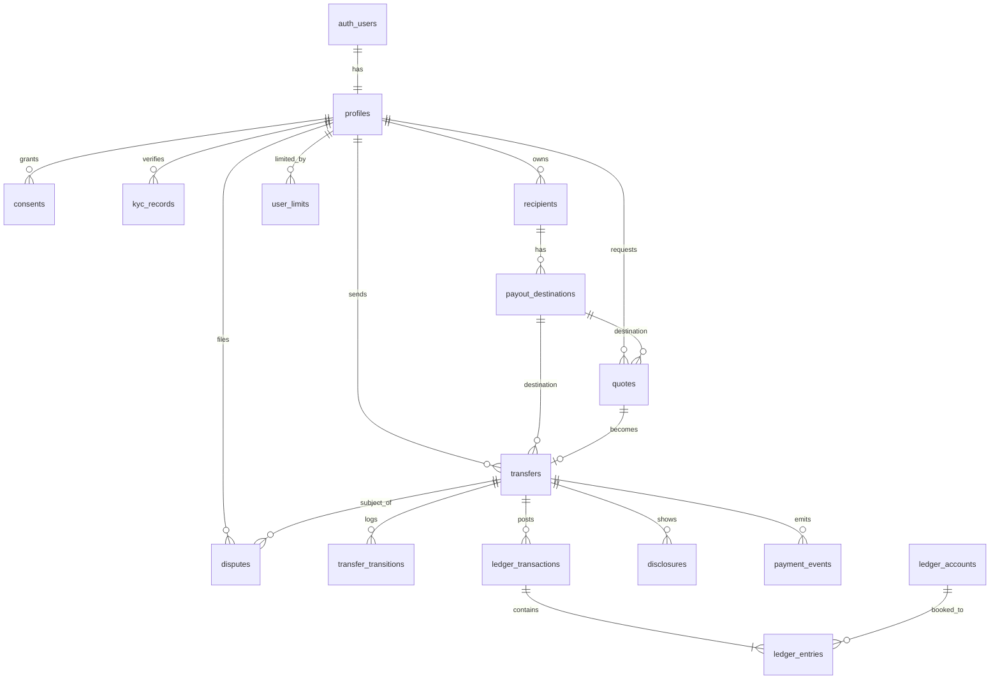

# Data Model / ERD — USD → MXN Remittance MVP

**Date:** 2026-07-02
**Status:** v1 draft for review
**Pairs with:** `transfer-state-machine.md`, `ledger-rules.md`

The schema behind the send-money flow. Designed for the full domain even though the MVP exercises a
slice, so the lending stack and richer risk controls slot in later without migration churn.

## Conventions

- **PKs:** `id UUID PRIMARY KEY DEFAULT gen_random_uuid()` on every table.
- **Timestamps:** `created_at` / `updated_at` (`timestamptz`) on every table; append-only tables omit
  `updated_at`.
- **Money:** every amount is a pair — `<x>_amount_minor BIGINT` + `<x>_currency TEXT`. Integer minor
  units only, never floats. USD across the ledger; MXN appears only as **display/disclosure metadata**
  (Puente never custodies MXN — see ledger-rules).
- **FKs indexed.** RLS **enabled on every table, deny-by-default.**
- **Access model: pure API.** The Fastify API uses the Supabase service role and bypasses RLS, so RLS
  is a defense-in-depth backstop, not the primary control. Clients never touch the DB directly.
- **Append-only tables** (no UPDATE/DELETE — revoke at the role level): `ledger_transactions`,
  `ledger_entries`, `transfer_transitions`, `payment_events`, `disclosures`, `audit_log`,
  and `consents` (grants/revocations are new rows).

## Relationships

## Identity & consent

### profiles  (1:1 with `auth.users`)
App-level user record; `auth.users` (Supabase-managed) holds phone/email/auth.
- `id` UUID PK **= auth.users.id** (FK)
- `full_name` TEXT *(PII)*
- `preferred_locale` TEXT — `en` | `es`
- `status` TEXT — `active` | `suspended` | `closed`
- `kyc_status` TEXT — `none` | `pending` | `approved` | `rejected` (denormalized from latest kyc_record)
- `risk_tier` TEXT — `trusted` | `standard` | `elevated` (drives the funding gate later)
- `provider_customer_ref` TEXT UNIQUE — Bridge customer id; set after KYC approval; used as `on_behalf_of` on transfers. Nullable until created.
- **RLS:** owner reads/updates own row.

### consents  *(append-only)*
- `user_id` FK → profiles
- `type` TEXT — `tos` | `privacy` | `esign` | `tcpa_sms`
- `doc_version` TEXT — exact version agreed to
- `granted_at` / `revoked_at` timestamptz
- `metadata` JSONB — ip/user-agent evidence (no extra PII)
- **RLS:** owner reads own.

## KYC

### kyc_records
We perform KYC via **Sumsub** and hand the result to Bridge; wrapped behind the `IdentityVerifier`
interface. Store **minimal** result + the Sumsub reference, not raw documents.
- `user_id` FK → profiles
- `provider` TEXT — `sumsub`
- `provider_ref` TEXT — Sumsub applicant id
- `status` TEXT — `pending` | `approved` | `rejected` | `review`
- `level` TEXT — verification level
- `result_summary` JSONB — non-document summary only
- `checked_at` / `expires_at` timestamptz
- **RLS:** service-role only (most sensitive PII).

## Money movement

### recipients  (the person)
A sender's saved recipients. Built for multi-country, multi-method payouts.
- `user_id` FK → profiles (owner/sender)
- `full_name` TEXT *(recipient PII)*
- `relationship` TEXT
- `country` TEXT — ISO-3166 (e.g. `MX`)
- `status` TEXT — `active` | `archived` (never hard-deleted)
- **RLS:** owner-scoped.

### payout_destinations  (how to pay a recipient)
One recipient → many destinations (bank, wallet, cash, card), varying by country.
- `recipient_id` FK → recipients
- `method` TEXT — `bank_account` | `wallet` | `cash_pickup` | `debit_card`
- `currency` TEXT — destination currency (metadata; never ledgered)
- `details` JSONB — method/country-specific, sensitive fields **encrypted**
  (`{clabe}` MX bank · `{account_number, swift/iban}` other bank · `{wallet_provider, wallet_id}` ·
  `{network, recipient_doc_ref}` cash)
- `label` TEXT — user nickname
- `status` TEXT — `active` | `archived`
- `provider_account_ref` TEXT UNIQUE — Bridge external account id; set when the destination is registered with Bridge as an external account. A transfer's destination references this id. Nullable until registered.
- `verification_status` TEXT DEFAULT `'unverified'` — `unverified` | `verified` | `failed`; Bridge Verification-of-Payee / name-match result. Gate payout submission if not `verified`. Set alongside `provider_account_ref`.
- **RLS:** owner-scoped (via recipient).

### quotes  *(Puente's firm, time-boxed offer — Bridge does not lock rates)*
Bridge gives only an *indicative* rate, but Reg E requires a firm number to the customer — so the
quote is **our** commitment. We quote `source_rate` minus an FX buffer and absorb near-instant
slippage (see ledger `fx_slippage`).
- `user_id` FK, `payout_destination_id` FK (nullable in schema for future rate-browsing; the v1 API
  requires it at quote creation — see api-contract)
- `send_amount_minor` / `send_currency` (USD)
- `receive_amount_minor` / `receive_currency` (destination ccy — metadata)
- `fx_rate` NUMERIC — customer-facing rate (source minus buffer)
- `source_rate` NUMERIC — Bridge indicative rate it was based on (reconciliation)
- `fx_rate_at` timestamptz
- `fee_amount_minor` / `fee_currency`
- `provider_quote_ref` TEXT **nullable** — Bridge gives no lock id
- `status` TEXT — `active` | `expired` | `consumed`
- `expires_at` timestamptz — *our* validity window
- **RLS:** owner-scoped.

### transfers  (the state-machine entity)
- `user_id` FK, `payout_destination_id` FK, `quote_id` FK
- `state` TEXT — `PENDING_PAYMENT` | `FUNDED` | `SUBMITTED` | `IN_FLIGHT` | `COMPLETED` |
  `PAYMENT_FAILED` | `CANCELED` | `PAYOUT_FAILED` | `REFUNDED` | `FUNDING_REVERSED` | `UNDER_REVIEW`
- **Snapshotted terms** (immutable copy from the quote): `send_amount_minor`/`_currency`,
  `receive_amount_minor`/`_currency`, `fx_rate`, `fx_rate_at`, `fee_amount_minor`/`_currency`,
  `provider_fee_amount_minor` *(estimated at quote; actual booked at `SUBMITTED` — Bridge doesn't lock)*
- `funding_source_type` TEXT — `ach` | `card` | (`loc` later) — **the abstraction hook**
- `funding_cleared` BOOLEAN default false — the gate flag
- `disclosure_accepted_at` timestamptz — when the sender accepted the Reg E prepayment disclosure (gates funding; set at `confirm`)
- `payment_at` timestamptz — when the sender paid (starts the cancellation clock)
- `cancelable_until` timestamptz — `payment_at + 30 min`; cancelable = `state = FUNDED AND now() < cancelable_until`
- `idempotency_key` TEXT UNIQUE — for the Bridge submission
- `provider_transfer_ref` TEXT — Bridge transfer id
- `funding_payment_ref` TEXT — funding processor payment id
- `completed_at` timestamptz
- **RLS:** owner **reads** own; **all writes service-role only** (clients never mutate transfer state).

### transfer_transitions  *(append-only state log)*
- `transfer_id` FK
- `from_state` TEXT (null on creation), `to_state` TEXT
- `actor` TEXT — `user` | `system` | `webhook:stripe` | `webhook:bridge` | `ops:<admin_id>`
- `reason` TEXT
- `metadata` JSONB — e.g. triggering event id
- **RLS:** service-role only (owner sees status via API).

## Ledger  (see ledger-rules.md for posting logic)

### ledger_accounts
- `code` TEXT UNIQUE — `cash_clearing` | `funding_receivable` | `due_from_bridge` |
  `transfer_payable` | `refunds_payable` | `fee_revenue` | `provider_fees` | `fx_slippage` |
  `loss_funding_reversed`
- `name` TEXT — human label
- `type` TEXT — `asset` | `liability` | `revenue` | `expense`
- `normal_balance` TEXT — `debit` | `credit` (explicit, prevents posting mistakes)
- `currency` TEXT — USD
- `owner_scope` TEXT — `platform` for now (per-user accounts arrive with wallets/LOC)
- **RLS:** service-role only.

### ledger_transactions  *(posting batch — append-only)*
- `transfer_id` FK (nullable for non-transfer events)
- `transition` TEXT — which state transition triggered it
- `idempotency_key` TEXT UNIQUE — `(transfer_id, transition)`; one batch per transition
- `description` TEXT, `posted_at` timestamptz
- **Invariant:** child entries net to zero (USD). **RLS:** service-role only.

### ledger_entries  *(immutable lines)*
- `ledger_transaction_id` FK, `account_id` FK
- `direction` TEXT — `debit` | `credit`
- `amount_minor` BIGINT `CHECK (amount_minor > 0)` (direction carries the sign), `currency` TEXT (USD)
- **Invariant (trigger):** a `ledger_transaction`'s entries must net to zero per currency — reject otherwise.
- **RLS:** service-role only.

## Compliance

### disclosures  *(Reg E evidence — append-only)*
Immutable snapshot of exactly what the user was shown.
- `transfer_id` FK
- `type` TEXT — `prepayment` | `receipt`
- `locale` TEXT
- `content` JSONB — amounts, fees, fx, cancellation + error-resolution language
- `presented_at` timestamptz
- **RLS:** owner reads own.

### disputes  (Reg E error resolution → `UNDER_REVIEW`)
- `transfer_id` FK, `user_id` FK
- `type` TEXT — `non_delivery` | `wrong_amount` | `unauthorized` | `other`
- `description` TEXT, `status` TEXT — `open` | `investigating` | `resolved`
- `resolution` TEXT, `opened_at` / `resolved_at` timestamptz
- **RLS:** owner reads own; ops writes.

## System

### payment_events  *(webhook log — append-only)*
- `source` TEXT — `stripe` | `bridge`, `event_type` TEXT
- `external_event_id` TEXT — **UNIQUE(source, external_event_id)** for idempotent processing
- `transfer_id` FK (nullable until resolved)
- `payload` JSONB, `received_at` / `processed_at` timestamptz, `status` TEXT
- **RLS:** service-role only.

### user_limits  *(config — defaults to unlimited for MVP)*
- `user_id` FK (nullable for `tier`/`global` defaults)
- `scope` TEXT — `user` | `tier` | `global` (supports defaults + overrides later)
- `per_transfer_max_minor` / `daily_max_minor` / `monthly_max_minor` BIGINT (nullable)
- `velocity_max_count` INT (nullable), `currency` TEXT
- `effective_from` / `effective_to` timestamptz — effective-dating for audit
- **RLS:** owner reads own; service writes.

### idempotency_keys  *(client-request idempotency — separate from the Bridge submission key on `transfers`)*
Backs the `Idempotency-Key` header on the money-moving POSTs (see api-contract). A replay returns the
stored response; same key + different body → `idempotency_conflict`.
- `key` TEXT — the client-supplied key
- `user_id` FK → profiles
- `endpoint` TEXT — e.g. `POST /v1/transfers`
- **UNIQUE(user_id, endpoint, key)**
- `request_hash` TEXT — hash of the canonical request body (detects same-key-different-body)
- `response_status` INT, `response_body` JSONB — snapshot returned on replay
- `expires_at` timestamptz — ~24h; purged by a scheduled job
- **RLS:** service-role only.

### audit_log  *(append-only)*
- `actor_user_id` (null for system), `actor_type` TEXT, `action` TEXT
- `entity_type` TEXT, `entity_id` UUID
- `metadata` JSONB (no raw PII), `trace_id` TEXT
- **RLS:** service-role only.

> **Float ceiling** is not a table — it's derived live as `SUM(funding_receivable)` and enforced in
> the app against a config value (env/settings). See ledger-rules + state machine.

> **Bridge wallet id** is not stored in the schema. **Open question (from the PoC + Bridge research
> 2026-07-10):** whether one Bridge transfer can carry USD/ACH source → MXN/SPEI destination with
> Bridge orchestrating the stablecoin sandwich internally, or whether it must be two legs through a
> Puente treasury wallet (the PoC's USD→USD move required the explicit two-leg wallet path). The
> instant-payout requirement likely means a **pre-funded treasury wallet** (payout leg fires
> immediately from wallet USDC; Stripe-collected funds replenish it) — in that topology one Puente
> transfer maps to one Bridge *payout* transfer plus batch replenishment transfers. Either way the
> wallet id belongs in app config (env var), not a schema column — same reasoning as the float
> ceiling. Resolve in sandbox before implementing the worker.

## RLS posture summary

| Access tier | Tables |
|---|---|
| **Owner-scoped** (owner SELECTs own; writes via API service role) | `profiles`, `consents`, `recipients`, `payout_destinations`, `quotes`, `transfers` (read-only to owner), `disclosures`, `disputes`, `user_limits` |
| **Service-role only** (no client access; append-only where noted) | `kyc_records`, `transfer_transitions`, `ledger_accounts`, `ledger_transactions`, `ledger_entries`, `payment_events`, `audit_log` |

Every table has RLS enabled and denies by default; the policies above are the explicit grants on top.
