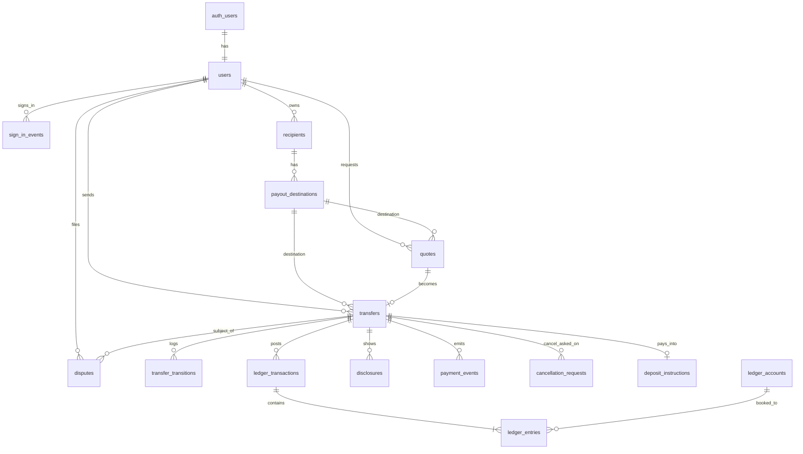

# Data Model / ERD — USD → MXN Remittance MVP

**Date:** 2026-07-02 · **Updated:** 2026-08-26 (de-stale pass: margin_minor, deposit_instructions,
payment_claimed_at, worker_heartbeat, otp_send_attempts; corrected the aspirational-vs-built split)
**Status:** Current through funding-ops slices 1–4 + the Stripe onramp rail (all 27 migrations)
**Pairs with:** `transfer-state-machine.md`, `ledger-rules.md`

The schema behind the send-money flow. Designed for the full domain even though the MVP exercises a
slice, so the lending stack and richer risk controls slot in later without migration churn.

## Conventions

- **PKs:** `id UUID PRIMARY KEY DEFAULT gen_random_uuid()` on every table.
- **Timestamps:** `created_at` / `updated_at` (`timestamptz`) on every table; append-only tables omit
  `updated_at`.
- **Money:** every amount is a pair — `<x>_amount_minor BIGINT` + `<x>_currency TEXT`. Integer minor
  units only, never floats. USD across the ledger; MXN appears only as **display/disclosure metadata**
  (Puente never custodies MXN — see ledger-rules).
- **FKs indexed.** RLS **enabled on every table, deny-by-default.**
- **Access model: pure API.** The Fastify API uses the Supabase service role and bypasses RLS, so RLS
  is a defense-in-depth backstop, not the primary control. Clients never touch the DB directly.
- **Append-only tables** (no UPDATE/DELETE — trigger + role-level revoke): `ledger_transactions`,
  `ledger_entries`, `transfer_transitions`, `disclosures`, `reconciliation_runs`, and
  `otp_send_attempts` (no UPDATE; DELETE only for the retention prune).
- **`payment_events`** is the **status-mutable event inbox**: its raw `payload` is immutable, but
  `status` / `processed_at` / `error` are updated in place as the worker processes each event (it
  carries a `moddatetime` `updated_at` trigger) — so it is **not** append-only.

## Relationships

```mermaid
erDiagram
    auth_users         ||--||  users               : has
    users              ||--o{  sign_in_events      : signs_in
    users              ||--o{  recipients          : owns
    users              ||--o{  quotes              : requests
    users              ||--o{  transfers           : sends
    users              ||--o{  disputes            : files
    recipients         ||--o{  payout_destinations : has
    payout_destinations||--o{  quotes              : destination
    payout_destinations||--o{  transfers           : destination
    quotes             ||--o|  transfers           : becomes
    transfers          ||--o{  transfer_transitions: logs
    transfers          ||--o{  ledger_transactions : posts
    transfers          ||--o{  disclosures         : shows
    transfers          ||--o{  payment_events      : emits
    transfers          ||--o{  disputes            : subject_of
    transfers          ||--o{ cancellation_requests: cancel_asked_on
    transfers          ||--o|  deposit_instructions: pays_into
    ledger_transactions||--|{  ledger_entries      : contains
    ledger_accounts    ||--o{  ledger_entries      : booked_to
```

FK-less tables (not drawn): `waitlist`, `reconciliation_runs` (summarizes the whole book),
`worker_heartbeat` (one row per dispatcher), `otp_send_attempts` (peppered phone hash, no user FK
by design — attempts precede accounts), `idempotency_keys` (FK to users only).

**Built vs. designed.** Earlier versions of this doc drew `consents`, `kyc_records`, `user_limits`,
and `audit_log` as if they existed. `consents` (K1) and `kyc_verifications` (K6, the built form of
`kyc_records`) now exist; **`user_limits` and `audit_log` are still not tables today** — see their sections below
for what carries each concern instead. `disputes` IS a real table (created with the transfers
migration) but has no routes or UI yet.

## Identity & consent

### users  (1:1 with `auth.users`)
App-level user record; `auth.users` (Supabase-managed) holds the auth identity. A trigger on
`auth.users` INSERT (`handle_new_user`) mirrors the row here.
- `id` UUID PK **= auth.users.id** (FK, ON DELETE CASCADE)
- `phone` TEXT UNIQUE NOT NULL
- `email` TEXT
- `first_name` / `last_name` TEXT *(PII)*
- `preferred_language` TEXT — `en` | `es` (CHECK)
- `status` TEXT — `waitlist` | `active` | `suspended` (CHECK; default `waitlist`)
- `fcra_consent_at` timestamptz — FCRA consent stamp (gates any future CRS call)
- `sms_consent_at` timestamptz — TCPA consent stamp (SMS OTP)
- `email_verified_at` timestamptz — **dormant on purpose**: stays null until email verification is
  built; not dead code
- `kyc_status` TEXT — `not_started` | `pending` | `approved` | `rejected` | `manual_review` (CHECK; set by the Bridge webhook `customer.*` branch and the K6 relay; history in `kyc_verifications`)
- `kyc_retry_count` INT — CHECK ≥ 0; the 3-retry ceiling is enforced in the API, not the DB
- `bridge_customer_id` TEXT UNIQUE — Bridge customer id; set by the K6 relay (or the legacy kyc-link path); used as `on_behalf_of` on transfers. Nullable until created.
- `bridge_signed_agreement_id` TEXT — K6: the LATEST Bridge ToS `signed_agreement_id` awaiting customer creation (single-use at Bridge; the immutable `consents` row is the evidence, this is the working pointer). Cleared in the same write that sets `bridge_customer_id`. Opaque id, not PII.
- `address_line1` / `address_line2` / `address_city` / `address_state` / `address_postal_code`
  TEXT *(PII — K2)* — sender's US home address, collected at the profile step. Nullable (pre-K2
  rows; the router bounces them to the profile form). Loose shape CHECKs in the DB; membership
  (50 states + DC) enforced in the API against `US_STATES` in packages/shared. Stored per the
  ratified custody posture: address is the one piece of KYC PII we *hold*. DOB and the tax ID are
  relayed once to Bridge (K6, `POST /v1/users/me/bridge-customer`) and never stored —
  `apps/api/src/routes/schema-pii.test.ts` scans every migration to pin that.
- `address_country` TEXT NOT NULL default `'US'` (CHECK `'US'` — widening is a deliberate migration)
- **RLS:** owner reads/updates own row.
- *`risk_tier` is NOT a column yet* — earlier versions listed it; it arrives with the risk engine.

### consents  *(append-only — built 2026-08-27, K1)*
Versioned-document consent (E-SIGN, Puente TOS/Privacy, Bridge TOS). The `users` timestamp
columns (`fcra_consent_at`, `sms_consent_at`) stay for their single-document consents; this
table is for documents whose versions change. Revocation is NOT an update — rows are immutable
evidence; a future withdrawal flow appends its own record.
- `user_id` FK → users (RESTRICT — consent evidence for a user with financial history survives)
- `type` TEXT — `esign` | `puente_tos` | `puente_privacy` | `bridge_tos` (CHECK)
- `version` TEXT — exact document version presented (the doc's "Last updated" date). Required
  versions live in code (`REQUIRED_CONSENTS`, packages/shared) — bumping one forces app-wide
  re-consent via the web `/continue` router
- `locale` TEXT — `en` | `es`, which language was presented (mirrors `disclosures`)
- `evidence` JSONB — ip/user-agent (no extra PII); `bridge_tos` rows (written server-side at
  first send) carry `signed_agreement_id`
- `consented_at` timestamptz
- UNIQUE (user_id, type, version) — re-granting the same version is an idempotent no-op that
  keeps the original evidence
- `forbid_mutation` trigger — no UPDATE/DELETE, same guard as `disclosures`
- **RLS:** owner reads own; no client-write policy (API service role only).

### stripe_link_tokens  *(K3 — Link OAuth credential store)*
One row per user: their Link OAuth state for the embedded-components onramp.
- `user_id` PK, FK → users (RESTRICT)
- `refresh_token_enc` TEXT — the 90-day refresh token, AES-256-GCM encrypted app-side
  (utils/encryption.ts, AAD = user_id; deliberate deviation from the plan's pgcrypto sketch —
  the key never reaches the DB server). NULL until the user consents and the exchange banks
  one. Rotates on every refresh grant. Access tokens (1h) are never persisted anywhere.
- `auth_intent_id` / `lai_expires_at` — web LAI reuse (fresh intent per page load = forced re-OTP)
- **RLS:** deny-all — no client role may even see the row exists.

Related `users` columns (K3): `stripe_crypto_customer_id` TEXT UNIQUE (crc_, from the SDK's
authenticate callback, verify-then-persist), `stripe_kyc_tier` / `stripe_kyc_tier_status`
(cache of the customers poll; deliberately unconstrained — they mirror a preview API that can
drift, and nothing authorizes off them).

### sign_in_events  *(append-only by convention)*
- `user_id` FK → users (CASCADE)
- `ip` INET, `user_agent` TEXT — never leave the DB (deny-all RLS)
- `auth_method` TEXT — default `sms_otp`
- **RLS:** deny-all (service-role only).

## KYC

### kyc_verifications  *(append-only — built 2026-09-03, K6; audit corner 2)*
One row per provider verdict observed. Two providers now verify the same sender — Stripe (L1/L2
in our UI) and Bridge (the Customers API relay) — and `users.kyc_status` / `stripe_kyc_tier*`
remain the derived "current" caches; this log records who said what, when, from where.
Supersedes the deferred `kyc_records` sketch (same shape: minimal result + provider ref, never
documents, never identity numbers).
- `user_id` FK → users (RESTRICT)
- `provider` TEXT — `stripe_crypto` | `bridge` (no CHECK on purpose: a third verifier is a row value, not a migration)
- `provider_ref` TEXT — `crc_…` / Bridge customer id (opaque)
- `status` TEXT — `pending` | `verified` | `rejected` | `review` (CHECK; OUR vocabulary)
- `provider_status` TEXT — the provider's raw word, kept beside the mapping (preview vocabularies drift)
- `tier` TEXT — Stripe tier (L1/L2) or a Bridge endorsement name
- `reasons` JSONB array — provider reason labels only, bounded by the API; never identity data
- `source` TEXT — `relay` | `webhook` | `poll`
- `occurred_at` / `created_at` timestamptz
- `forbid_mutation` trigger — append-only, same guard as `consents`
- **RLS:** deny-all (service-role only). Writers are best-effort and never block the primary write.

## Money movement

### recipients  (the person)
A sender's saved recipients. Built for multi-country, multi-method payouts.
- `user_id` FK → users (owner/sender)
- `first_name` / `last_name` TEXT *(recipient PII)*
- `relationship` TEXT
- `country` TEXT — ISO-3166 (e.g. `MX`)
- `status` TEXT — `active` | `archived` (never hard-deleted)
- **RLS:** owner-scoped.

### payout_destinations  (how to pay a recipient)
One recipient → many destinations (bank, wallet, cash, card), varying by country.
- `recipient_id` FK → recipients
- `method` TEXT — `bank_account` | `wallet` | `cash_pickup` | `debit_card`
- `currency` TEXT — destination currency (metadata; never ledgered)
- `details` JSONB — method/country-specific, sensitive fields **encrypted**
  (`{clabe}` MX bank · `{account_number, swift/iban}` other bank · `{wallet_provider, wallet_id}` ·
  `{network, recipient_doc_ref}` cash)
- `label` TEXT — user nickname
- `status` TEXT — `active` | `archived`
- `provider_account_ref` TEXT UNIQUE — Bridge external account id; set when the destination is registered with Bridge as an external account. A transfer's destination references this id. Nullable until registered.
- `verification_status` TEXT DEFAULT `'unverified'` — `unverified` | `verified` | `failed`; Bridge Verification-of-Payee / name-match result. Gate payout submission if not `verified`. Set alongside `provider_account_ref`.
- **RLS:** owner-scoped (via recipient).

### quotes  *(Puente's firm, time-boxed offer — Bridge does not lock rates)*
Bridge gives only an *indicative* rate, but Reg E requires a firm number to the customer — so the
quote is **our** commitment. We quote `source_rate` minus an FX buffer and absorb near-instant
slippage (see ledger `fx_slippage`).
- `user_id` FK, `payout_destination_id` FK (nullable in schema for future rate-browsing; the v1 API
  requires it at quote creation — see api-contract)
- `send_amount_minor` / `send_currency` (USD) — since the merged-rate change (#193), this is the
  FULL customer pay-in
- `receive_amount_minor` / `receive_currency` (destination ccy — metadata)
- `fx_rate` NUMERIC(12,4) — customer-facing rate (margin + buffer already inside it)
- `source_rate` NUMERIC(18,8) — Bridge `buy_rate` it was based on (reconciliation)
- `fx_rate_at` timestamptz
- `fee_amount_minor` / `fee_currency` — **0 on merged-rate quotes**; the take moved to `margin_minor`
- `margin_minor` BIGINT — Puente's take hidden in the rate (#193, 2026-08-17). CHECK ≥ 0 and
  `quotes_margin_lt_send` (margin < send). Ledger identities: `revenue = fee + margin`,
  `principal = send − margin` (see ledger-rules.md)
- `provider_quote_ref` TEXT **nullable** — Bridge gives no lock id
- `status` TEXT — `active` | `expired` | `consumed`
- `expires_at` timestamptz — *our* validity window (CHECK > created_at)
- **Frozen terms trigger** (`enforce_quotes_terms_frozen`): only `status` may change after insert —
  every economic term, `margin_minor` included, is immutable
- **RLS:** owner-scoped.

### transfers  (the state-machine entity)
- `user_id` FK (**RESTRICT** — a user with financial history is undeletable), `payout_destination_id` FK,
  `quote_id` FK **UNIQUE** (single-use backstop)
- `state` TEXT — `PENDING_PAYMENT` | `FUNDED` | `SUBMITTED` | `IN_FLIGHT` | `COMPLETED` |
  `PAYMENT_FAILED` | `CANCELED` | `PAYOUT_FAILED` | `REFUNDED` | `FUNDING_REVERSED` | `UNDER_REVIEW`
- **Snapshotted terms** (immutable copy from the quote, enforced by the `enforce_transfers_terms_frozen`
  denylist trigger): `send_amount_minor`/`_currency`, `receive_amount_minor`/`_currency`, `fx_rate`,
  `fx_rate_at`, `fee_amount_minor`/`_currency`, `margin_minor` (#193, same identities as on quotes),
  `provider_fee_amount_minor` *(estimated at quote; actual booked at `SUBMITTED` — Bridge doesn't lock)*
- `funding_source_type` TEXT — `ach` | `card` | (`loc` later) — **the abstraction hook**
- `funding_cleared` BOOLEAN default false — the gate flag
- `disclosure_accepted_at` timestamptz — when the sender accepted the Reg E prepayment disclosure (gates funding; set at `confirm`)
- `payment_at` timestamptz — when the sender paid (starts the cancellation clock)
- `cancelable_until` timestamptz — `payment_at + 30 min`; disclosure metadata only since slice 5 (immediate payout) — cancelable = `state = FUNDED AND submit_attempted_at IS NULL` (see transfer-state-machine.md)
- `submit_attempted_at` timestamptz — the payout **claim**; set once by the winning guarded UPDATE (`state = 'FUNDED' AND payout_hold_reason IS NULL AND submit_attempted_at IS NULL`). Non-null means a Bridge submission may exist, so crash recovery re-POSTs idempotently. Service-role mutated (not frozen)
- `payout_hold_reason` TEXT — `fx_drift` | `payability` | `submit_error` | `velocity_review` (CHECK);
  set when the submit job refuses to submit. A hold is `FUNDED` + this column, not a state; ops clears
  it to release. `float_ceiling` is deliberately **not** a hold reason. Nullable
- `payout_held_at` timestamptz — when a hold was placed (alongside `payout_hold_reason`)
- `refund_payment_ref` TEXT / `refunded_at` timestamptz — the undo record: a void ref (cancel path)
  OR a refund ref (payout-failure path); one undo per transfer
- `idempotency_key` TEXT UNIQUE — for the Bridge submission
- `provider_transfer_ref` TEXT — Bridge transfer id
- `funding_payment_ref` TEXT — funding processor payment id
- `refund_claimed_at` / `refund_claimed_by` — the **Refund claim** (slice-7 PR6b-0); the guarded UPDATE one run wins before calling the processor's refund. Never cleared on success; cleared only by `releaseStaleRefundClaim` after 10 min. Deliberately asymmetric to `submit_attempted_at` — see [decisions.md](decisions.md) 2026-07-28. Service-role mutated (not frozen)
- `cancellation_requested_at` timestamptz — denormalized flag: the sender asked to cancel a transfer already on its way to payout (slice-7 PR6b). A flag **orthogonal to state**, not a state — the payout keeps advancing while the request is open. Keeps the FIRST ask's timestamp. Service-role mutated (not frozen)
- `payment_claimed_at` timestamptz — the sender tapped "I've sent the payment" (funding-ops slice 4).
  A **signal to ops, not a state change** — state stays `PENDING_PAYMENT`. Set-once by the API
  (`WHERE payment_claimed_at IS NULL`); unrelated to the refund claim columns
- `completed_at` timestamptz — write-once, but enforced **inside `transition_transfer` v3**
  (`coalesce(completed_at, now())`), not by a DB constraint — a raw service-role UPDATE could still
  overwrite it
- **RLS:** owner **reads** own; **all writes service-role only** (clients never mutate transfer state).

### transfer_transitions  *(append-only state log)*
- `transfer_id` FK
- `from_state` TEXT (null on creation), `to_state` TEXT
- `actor` TEXT — `user` | `system` | `webhook:funding` | `webhook:bridge` | `worker:payment-event` | `ops:<admin_id>`
- `reason` TEXT
- `metadata` JSONB — e.g. triggering event id
- **RLS:** service-role only (owner sees status via API).

## Ledger  (see ledger-rules.md for posting logic)

### ledger_accounts
- `code` TEXT UNIQUE — `cash_clearing` | `bridge_wallet_float` | `funding_receivable` |
  `due_from_bridge` | `transfer_payable` | `refunds_payable` | `fee_revenue` | `provider_fees` |
  `fx_slippage` | `loss_funding_reversed` | `loss_cancellation_correction` (slice-7 PR6b;
  ledger-rules.md chart is authoritative)
- `name` TEXT — human label
- `type` TEXT — `asset` | `liability` | `revenue` | `expense`
- `normal_balance` TEXT — `debit` | `credit` (explicit, prevents posting mistakes)
- `currency` CHAR(3) — USD (as built: `char(3)` + `^[A-Z]{3}$` check, per financial-schema-checklist)
- `owner_scope` TEXT — `platform` for now (per-user accounts arrive with wallets/LOC)
- **RLS:** service-role only.

### ledger_transactions  *(posting batch — append-only)*
- `transfer_id` FK (nullable for non-transfer events)
- `transition` TEXT — which state transition triggered it
- `idempotency_key` TEXT UNIQUE — `(transfer_id, transition)`; one batch per transition
- `description` TEXT, `posted_at` timestamptz
- **Invariant:** child entries net to zero (USD). **RLS:** service-role only.

### ledger_entries  *(immutable lines)*
- `ledger_transaction_id` FK, `account_id` FK
- `direction` TEXT — `debit` | `credit`
- `amount_minor` BIGINT `CHECK (amount_minor > 0)` (direction carries the sign), `currency` TEXT (USD)
- **Invariant (trigger):** a `ledger_transaction`'s entries must net to zero per currency — reject otherwise.
- **RLS:** service-role only.

## Compliance

### disclosures  *(Reg E evidence — append-only)*
Immutable snapshot of exactly what the user was shown.
- `transfer_id` FK
- `type` TEXT — `prepayment` | `receipt`
- `locale` TEXT — `en` | `es` (CHECK)
- `content` JSONB — amounts, fees, fx, cancellation + error-resolution language
- `presented_at` timestamptz
- **UNIQUE (transfer_id, type)** — one of each per transfer; enables the idempotent receipt upsert
- **RLS:** owner reads own.

### deposit_instructions  (the manual/onramp funding rail's coordinates — 1:1 with transfers)
Where the sender's money should go for an out-of-band or onramp-funded transfer: **Puente's own
receiving-bank coordinates** pulled off a Bridge onramp — not sender PII, so plaintext is
intentional. Since funding-ops slice 3, attach is **automatic at confirm** (the
`funding.onramp_prepare` job); the ops route/CLI is break-glass.
- `transfer_id` FK **UNIQUE** — one row per transfer; re-attach is an upsert that OVERWRITES
  (history lives in the request logs)
- `bridge_transfer_ref` TEXT — the Bridge onramp id; also the idempotency ref `deposit-landed` keys on
- `amount_minor` BIGINT / `currency` (`USD` CHECK)
- `payment_rail` TEXT — `ach` | `wire` | `fednow` (CHECK; Bridge rails mapped to canonical values, #208)
- `bank_name` / `bank_routing_number` (9-digit CHECK) / `bank_account_number` / `bank_beneficiary_name`
- `deposit_message` TEXT — the Bridge reference code the sender must include; **load-bearing** for
  Bridge to match the deposit
- `attached_by` UUID **nullable, no default** — null = attached by the system at confirm; a uuid =
  the operator who ran the break-glass attach. Writers must state provenance explicitly
- **RLS:** owner reads own (via transfers join); writes service-role only.

### cancellation_requests  (§1005.34 cancellation — **NOT** `disputes`)
- `transfer_id` FK, `user_id` FK
- `requested_at` timestamptz — **the statutory clock**; separate from `created_at`, which is a row-audit fact
- `requested_state` TEXT — `FUNDED` | `SUBMITTED` | `IN_FLIGHT` (CHECK); which 202 branch produced it. `FUNDED` here means FUNDED-**post-claim**
- `within_window` BOOLEAN — timeliness vs the transfer's `cancelable_until`, computed once inside `record_cancellation_request` and then frozen. Only a timely request creates an automatic full-refund obligation
- `status` TEXT — `pending` | `resolved_refunded` | `resolved_denied` (CHECK)
- `resolution` TEXT, `resolved_at` timestamptz, `resolved_by` TEXT — who CLOSED it (not necessarily who paid)
- **Partial UNIQUE `(transfer_id) WHERE status = 'pending'`** — at most one open ask per transfer, so a second tap resolves to the first and never restarts the clock
- **RLS:** owner reads own via the `transfers` join; **writes service-role only**
- **Deliberately not the `disputes` table below.** §1005.34 cancellation is not §1005.33 error
  resolution: different clocks, different remedies, different lawful denials. A cancellation needs no
  investigation — the sender has an unconditional right, exercised in time or not. See
  [decisions.md](decisions.md) 2026-07-28.

### disputes  (Reg E error resolution → `UNDER_REVIEW`)  *(table built; no routes or UI yet)*
- `transfer_id` FK, `user_id` FK
- `type` TEXT — `non_delivery` | `wrong_amount` | `unauthorized` | `other`
- `description` TEXT, `status` TEXT — `open` | `investigating` | `resolved`
- `resolution` TEXT, `opened_at` / `resolved_at` timestamptz
- **RLS:** owner reads own; ops writes.

## System

### payment_events  *(provider event inbox — webhook + poll; status-mutable, not append-only)*
- `source` TEXT — `bridge` | `bridge_poll` | `funding`, `event_type` TEXT
- `external_event_id` TEXT — **UNIQUE(source, external_event_id)** for idempotent processing
- `transfer_id` FK (nullable until resolved)
- `provider_ref` TEXT — provider-side transfer id, when present
- `payload` JSONB *(immutable raw payload — service-role only, never logged)*, `received_at` / `processed_at` timestamptz
- `status` TEXT — `received` | `processed` | `ignored` | `failed` (mutated in place; `moddatetime` `updated_at` trigger)
- `error` TEXT — failure/ignore detail stamped when the row is marked
- **RLS:** service-role only.

### reconciliation_runs  *(daily ledger.reconcile cron output — append-only)*
One row per run of the O2 reconciliation cron (`docs/runbooks/reconciliation.md`). No FKs — it
summarizes the whole book, not one entity.
- `started_at` / `finished_at` timestamptz
- `status` TEXT — `pass` | `findings` | `error` (`error` = a check could not complete)
- `findings_count` INT
- `checks` JSONB — per-check array (name, status, findings_count, summary; refs/counts only, no PII)
- `balances` JSONB — full chart-of-accounts snapshot at run time
- **Append-only** (same trigger as the ledger) · **RLS:** service-role only.

### worker_heartbeat  (liveness proof for the cron dispatcher — deliberately mutable)
- `worker` TEXT **PK** (natural key — the logical dispatcher, not a process)
- `instance` TEXT — deploy short-sha, diagnostic only
- `updated_at` — **the beat**, written only by the DB's `moddatetime` trigger so a skewed worker
  clock cannot self-report alive
- One row, PK upsert, no indexes; **RLS deny-all**. The opposite posture to `reconciliation_runs`
  on purpose. Born from the ~22h silent staging cron outage of 2026-08-02.

### otp_send_attempts  (SMS-pumping defense — append-only)
- `id` BIGINT identity PK (the only non-uuid PK in the schema)
- `phone_hash` TEXT — HMAC-SHA256(pepper, phone), hex CHECK; **never a raw phone**
- Admission goes through `otp_attempt_admit(phone_hash, cooldown, max_hour, max_day)` — serialized
  per number by an advisory lock; the attempt is recorded on admission (before the Twilio call);
  refused attempts are not recorded. Backs the NANP allowlist + per-phone budget (#188)
- **RLS deny-all**; service-role gets SELECT/INSERT/DELETE only (no UPDATE; DELETE = retention prune).

### user_limits  *(deferred — not built)*
There is no `user_limits` table. The AML launch limits are **env-config constants** read by
`services/risk.ts` (`RISK_PER_TXN_MAX_MINOR`, `RISK_DAILY_MAX_MINOR`, `RISK_MONTHLY_MAX_MINOR`,
`RISK_SEMIANNUAL_MAX_MINOR`, `RISK_VELOCITY_MAX_COUNT`, `RISK_UNCLEARED_MAX_COUNT`), evaluated
against live queries over `transfers`. A per-user overrides table (scope, effective dating) remains
the future shape once limits vary by user/tier.

### idempotency_keys  *(client-request idempotency — separate from the Bridge submission key on `transfers`)*
Backs the `Idempotency-Key` header on the money-moving POSTs (see api-contract). A replay returns the
stored response; same key + different body → `idempotency_conflict`.
- `key` TEXT — the client-supplied key
- `user_id` FK → users
- `endpoint` TEXT — e.g. `POST /v1/transfers`
- **UNIQUE(user_id, endpoint, key)**
- `request_hash` TEXT — hash of the canonical request body (detects same-key-different-body)
- `response_status` INT, `response_body` JSONB — snapshot returned on replay
- `expires_at` timestamptz — ~24h; purged by a scheduled job
- **RLS:** service-role only.

### audit_log  *(deferred — not a table)*
There is no `audit_log` table. The audit trail today is three layered records: **structured request
logs** (the `audit.ts` plugin stamps `audit: true` + route/actor onto every authenticated request's
log line), the append-only **`transfer_transitions`** state log, and the append-only **ledger**.
A queryable audit table remains the future shape if log retention stops being enough.

> **Float ceiling** is not a table — it's derived live as `SUM(funding_receivable)` and enforced in
> the app against a config value (env/settings). See ledger-rules + state machine.

> **Bridge wallet id** is not stored in the schema. **RESOLVED 2026-07-13 (sandbox spike):** Bridge
> has no one-transfer fiat→SPEI route — `ach_push`/`ach`/`wire` USD sources × `spei` MXN destination
> all return `route not supported`. Puente assembles the stablecoin sandwich itself via a
> **pre-funded treasury wallet**: the payout leg is ONE Bridge transfer (wallet USDC → MXN SPEI;
> verified in sandbox, `201` → `funds_received` in seconds), and replenishment (USD → USDC onramp,
> proven in the prod PoC) is a separate batch process — so **one Puente transfer maps to one Bridge
> payout transfer**, never two. Payouts fix `destination.amount` (MXN) so the recipient receives
> exactly the disclosed amount (Reg E); the variable USDC draw is where FX variance lands (see
> ledger `fx_slippage`). Bridge minimum: destination ≥ $2.00 USD equivalent. The wallet id lives in
> app config (env var), not a schema column — same reasoning as the float ceiling.

## RLS posture summary

| Access tier | Tables |
|---|---|
| **Owner-scoped** (owner SELECTs own; writes via API service role) | `users` (also updates own), `recipients`, `payout_destinations`, `quotes`, `transfers`, `disclosures`, `disputes`, `cancellation_requests`, `deposit_instructions` |
| **Deny-all policy** (explicit `USING (false)`) | `sign_in_events`, `ledger_accounts`, `ledger_transactions`, `ledger_entries`, `reconciliation_runs`, `worker_heartbeat`, `otp_send_attempts` |
| **RLS on, zero policies** (equivalent deny; deliberate) | `transfer_transitions`, `idempotency_keys`, `payment_events` |
| **Insert-only grant** | `waitlist` (service-role INSERT) |

Every table has RLS enabled and denies by default; the policies above are the explicit grants on top.
Every schema function is `REVOKE ... FROM public, anon, authenticated` + `GRANT EXECUTE TO
service_role` — including `transition_transfer` (the ONLY transfer-state write path, v3 makes
`completed_at` write-once), `post_ledger_transaction` (the ONLY ledger write path),
`cancel_transfer`, `record_cancellation_request`, `otp_attempt_admit`, and
`ops_transfer_state_counts()` — a set-returning **function**, not a view or table, backing
`GET /v1/ops/overview` (a GROUP BY can never silently uncount a future state).
