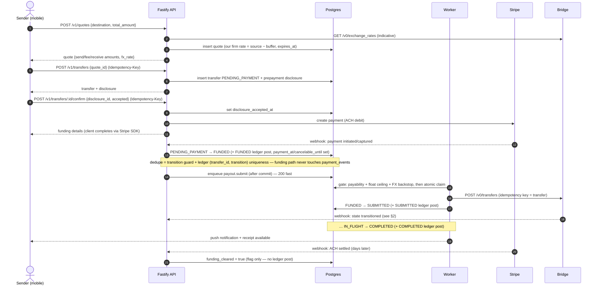
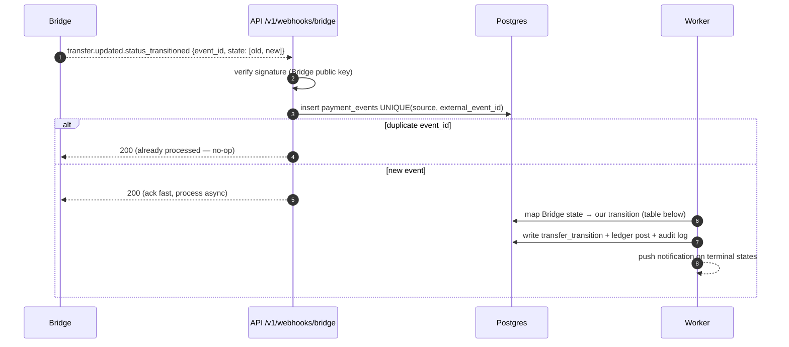
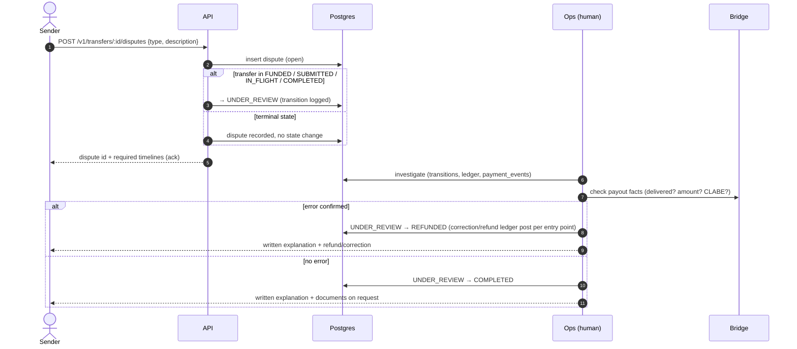

# Flow / Sequence Diagrams — USD → MXN Remittance

**Date:** 2026-07-10 · **Updated:** 2026-07-21 (slice 5 — payout lifecycle)
**Status:** slice-5-current
**Pairs with:** `transfer-state-machine.md` (states), `ledger-rules.md` (postings),
`api-contract.md` (routes), `architecture.md` (components)

The four flows the pre-implementation checklist calls for: send-money happy path, payout webhook,
error resolution, cancel/refund. States in `CAPS` are transfer states; ledger postings are named,
not restated (ledger-rules.md is authoritative).

## 1. Send money — happy path



Key properties: jobs are enqueued after the state change commits and are idempotent replays — a
lost enqueue is healed by the 1-min sweep, never a correctness problem (enqueue-after-commit, not a
transactional outbox; see decisions.md 2026-07-20); every external money call carries an
idempotency key; webhooks are the source of truth for `FUNDED`, `IN_FLIGHT`, `COMPLETED`.

## 2. Payout webhook (Bridge → us)



### Bridge state → Puente transition map

Bridge states never move backwards: `awaiting_funds → funds_received → payment_submitted →
payment_processed`, with failure states off to the side.

| Bridge state | Puente transition |
|---|---|
| `awaiting_funds` / `funds_received` | (no-op — we're already `SUBMITTED`) |
| `payment_submitted` | `SUBMITTED → IN_FLIGHT` |
| `payment_processed` | `IN_FLIGHT → COMPLETED` |
| `undeliverable`, `error`, `canceled` | `SUBMITTED`/`IN_FLIGHT → PAYOUT_FAILED` → refund flow |
| `returned`, `refunded`, `refund_in_flight` | `PAYOUT_FAILED` path — Bridge returning principal (ledger deferred — slice 6) |
| `refund_failed` | `PAYOUT_FAILED` + **ops alert** — principal stuck at Bridge (stuck-transfer runbook) |
| `in_review` | **no state change**; transfer stays `SUBMITTED`/`IN_FLIGHT`. Observed in sandbox (2026-07-13) as a routine *transient initial state* on payout creation, resolving to `funds_received` in seconds — so alert only when it **persists** (> 1h), which indicates a real Bridge-side review/AML hold |
| *unmapped / unknown state* | **no-op** — the processor marks the event `ignored` and never crashes on a never-before-seen Bridge state |

Missed webhooks are backstopped by reconciliation (cron polls `GET /v0/transfers` for
non-terminal transfers — see reconciliation runbook).

**Payout topology (resolved 2026-07-13):** one Puente transfer = one Bridge payout leg from the
pre-funded treasury wallet — authoritative write-up in the **Bridge wallet id** note in
[`erd.md`](erd.md).

## 3. Error resolution (Reg E §1005.33) — dispute



Only two exits, ops-driven, never self-resolving. Deadlines, notice content, and the investigation
checklist live in `runbooks/proposals/error-resolution.md`.

## 4. Cancel / refund

```mermaid
sequenceDiagram
    autonumber
    actor S as Sender
    participant API as API
    participant DB as Postgres
    participant W as Worker
    participant ST as Stripe

    S->>API: POST /v1/transfers/:id/cancel (Idempotency-Key)
    API->>DB: SELECT ... FOR UPDATE (row lock on transfer)
    alt state = FUNDED and submit_attempted_at is null
        API->>DB: FUNDED → CANCELED (commits only if still FUNDED and unclaimed — TOCTOU guard)
        API-->>S: 200 canceled
        W->>DB: CANCELED ledger post (ACH in flight vs not — two variants)
        W->>ST: refund / release payment
        W->>DB: CANCELED → REFUNDED (+ refund paid post)
        W-->>S: push: refunded (full amount incl. fee, within 3 business days)
    else already claimed / SUBMITTED / IN_FLIGHT
        API-->>S: state-keyed refund path (timely Reg E cancel → full refund; see below)
    end
```

The same row lock protects the other side: the submit job's atomic claim (`submit_attempted_at`,
guarded on `state = 'FUNDED'`) and the cancel guard (`submit_attempted_at IS NULL`) serialize on the
row — cancel and payout can never both win. A timely §1005.34 cancel that arrives after the claim is
NOT a 409: the right survives until pickup/deposit, so it is honored as a full refund once the
payout resolves (state-keyed refund rule, slice 6 — see transfer-state-machine.md).

`PAYOUT_FAILED → REFUNDED` (Bridge can't deliver) follows the same refund tail: Bridge returns
principal → recognize `refunds_payable` (full amount incl. fee) → pay refund → notify sender.
