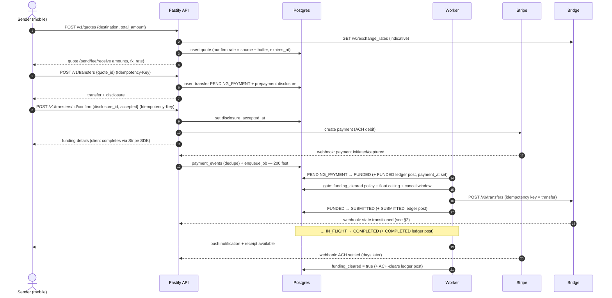
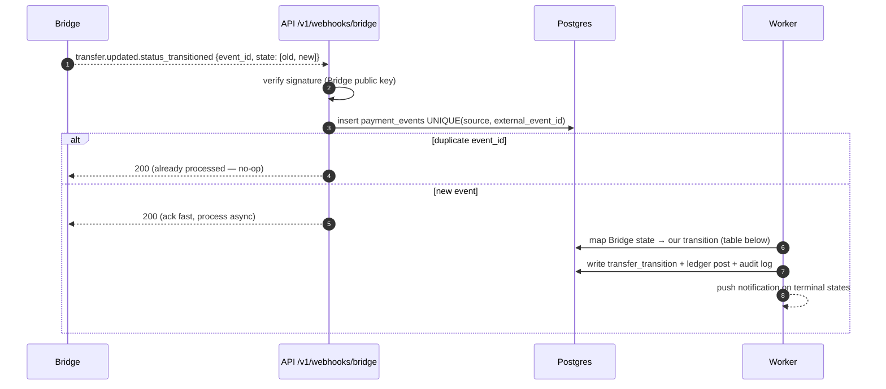
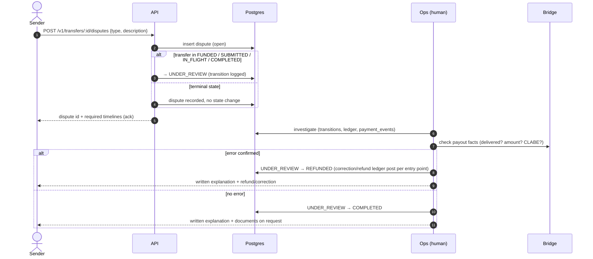
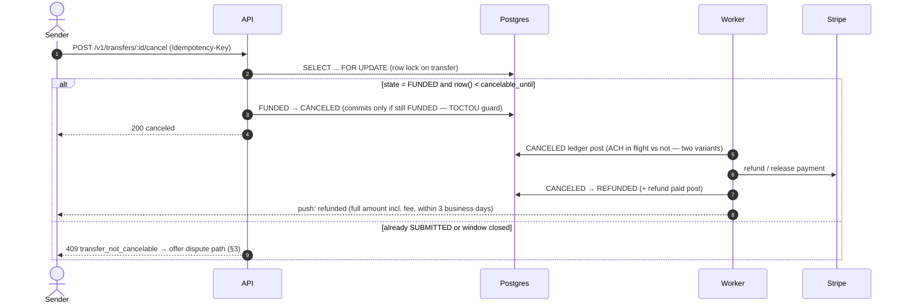

# Flow / Sequence Diagrams — USD → MXN Remittance

**Date:** 2026-07-10
**Status:** v1
**Pairs with:** `transfer-state-machine.md` (states), `ledger-rules.md` (postings),
`api-contract.md` (routes), `architecture.md` (components)

The four flows the pre-implementation checklist calls for: send-money happy path, payout webhook,
error resolution, cancel/refund. States in `CAPS` are transfer states; ledger postings are named,
not restated (ledger-rules.md is authoritative).

## 1. Send money — happy path

Key properties: the state change and the "next step" job commit in one DB transaction (outbox);
every external money call carries an idempotency key; webhooks are the source of truth for
`FUNDED`, `IN_FLIGHT`, `COMPLETED`.

## 2. Payout webhook (Bridge → us)

### Bridge state → Puente transition map

Bridge states never move backwards: `awaiting_funds → funds_received → payment_submitted →
payment_processed`, with failure states off to the side.

| Bridge state | Puente transition |
|---|---|
| `awaiting_funds` / `funds_received` | (no-op — we're already `SUBMITTED`) |
| `payment_submitted` | `SUBMITTED → IN_FLIGHT` |
| `payment_processed` | `IN_FLIGHT → COMPLETED` |
| `undeliverable`, `error`, `canceled` | `SUBMITTED`/`IN_FLIGHT → PAYOUT_FAILED` → refund flow |
| `returned`, `refunded`, `refund_in_flight` | `PAYOUT_FAILED` path — Bridge returning principal (ledger: Bridge-returns post) |
| `refund_failed` | `PAYOUT_FAILED` + **ops alert** — principal stuck at Bridge (stuck-transfer runbook) |
| `in_review` | **no state change**; transfer stays `SUBMITTED`/`IN_FLIGHT`, ops alert if > 1h (Bridge-side AML hold — *open question: confirm semantics with Bridge*) |

Missed webhooks are backstopped by reconciliation (cron polls `GET /v0/transfers` for
non-terminal transfers — see reconciliation runbook).

## 3. Error resolution (Reg E §1005.33) — dispute

Only two exits, ops-driven, never self-resolving. Deadlines, notice content, and the investigation
checklist live in `runbooks/error-resolution.md`.

## 4. Cancel / refund

The same row lock protects the other side: the worker's `FUNDED → SUBMITTED` submission commits only
if the row is still `FUNDED` — cancel and payout can never both win.

`PAYOUT_FAILED → REFUNDED` (Bridge can't deliver) follows the same refund tail: Bridge returns
principal → recognize `refunds_payable` (full amount incl. fee) → pay refund → notify sender.
