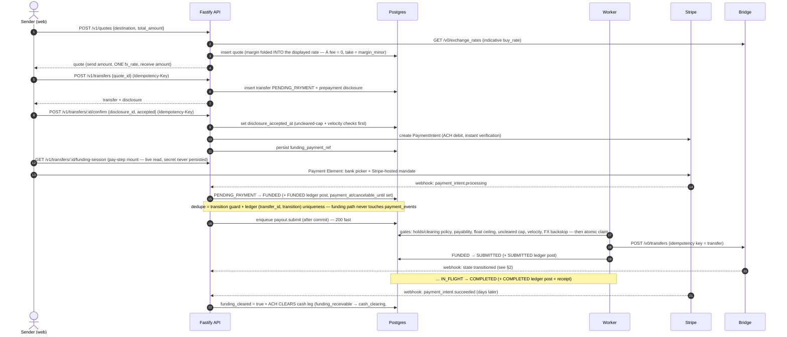
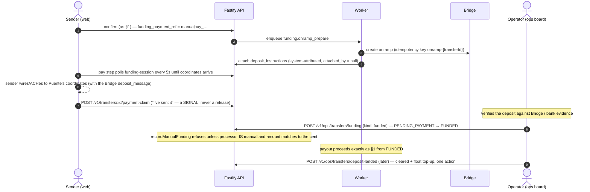
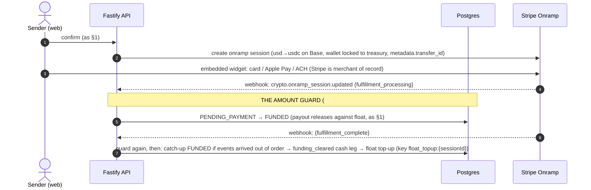
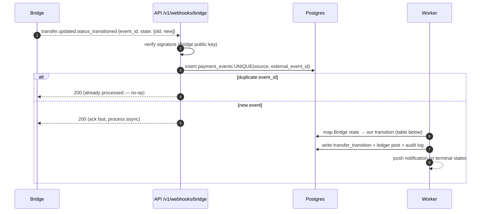
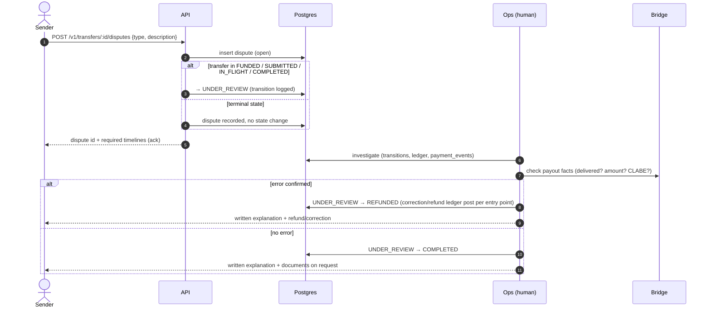

# Flow / Sequence Diagrams — USD → MXN Remittance

**Date:** 2026-07-10 · **Updated:** 2026-08-26 (de-stale pass: merged-rate quote, the four funding
rails as first-class flows, onramp guard, funding-cleared cash leg, AUTO_REFUND gate, ops actions)
**Status:** current through funding-ops slices 1–4 + the Stripe onramp rail
**Pairs with:** `transfer-state-machine.md` (states), `ledger-rules.md` (postings),
`api-contract.md` (routes), `architecture.md` (components)

The flows: send-money happy path (per funding rail), payout webhook, error resolution,
cancel/refund. States in `CAPS` are transfer states; ledger postings are named, not restated
(ledger-rules.md is authoritative).

## 1. Send money — happy path (stripe Payment Element rail)

```mermaid
sequenceDiagram
    autonumber
    actor S as Sender (web)
    participant API as Fastify API
    participant DB as Postgres
    participant W as Worker
    participant ST as Stripe
    participant BR as Bridge

    S->>API: POST /v1/quotes {destination, total_amount}
    API->>BR: GET /v0/exchange_rates (indicative buy_rate)
    API->>DB: insert quote (margin folded INTO the displayed rate — #193; fee = 0, take = margin_minor)
    API-->>S: quote {send amount, ONE fx_rate, receive amount}

    S->>API: POST /v1/transfers {quote_id} (Idempotency-Key)
    API->>DB: insert transfer PENDING_PAYMENT + prepayment disclosure
    API-->>S: transfer + disclosure

    S->>API: POST /v1/transfers/:id/confirm {disclosure_id, accepted} (Idempotency-Key)
    API->>DB: set disclosure_accepted_at (uncleared-cap + velocity checks first)
    API->>ST: create PaymentIntent (ACH debit, instant verification)
    API->>DB: persist funding_payment_ref
    S->>API: GET /v1/transfers/:id/funding-session (pay-step mount — live read, secret never persisted)
    S->>ST: Payment Element: bank picker + Stripe-hosted mandate

    ST-->>API: webhook: payment_intent.processing
    API->>DB: PENDING_PAYMENT → FUNDED (+ FUNDED ledger post, payment_at/cancelable_until set)
    Note over API,DB: dedupe = transition guard + ledger (transfer_id, transition) uniqueness — funding path never touches payment_events
    API->>DB: enqueue payout.submit (after commit) — 200 fast
    W->>DB: gates: holds/clearing policy, payability, float ceiling, uncleared cap, velocity, FX backstop — then atomic claim
    W->>BR: POST /v0/transfers (idempotency key = transfer)
    W->>DB: FUNDED → SUBMITTED (+ SUBMITTED ledger post)

    BR-->>API: webhook: state transitioned (see §2)
    Note over W,DB: … IN_FLIGHT → COMPLETED (+ COMPLETED ledger post + receipt)
    ST-->>API: webhook: payment_intent.succeeded (days later)
    API->>DB: funding_cleared = true + ACH CLEARS cash leg (funding_receivable → cash_clearing, #145)
```

## 1b. Send money — manual (out-of-band) rail — how real prod transfers move today

```mermaid
sequenceDiagram
    autonumber
    actor S as Sender (web)
    participant API as Fastify API
    participant W as Worker
    participant BR as Bridge
    actor OPS as Operator (ops board)

    S->>API: confirm (as §1) — funding_payment_ref = manualpay_…
    API->>W: enqueue funding.onramp_prepare
    W->>BR: create onramp (idempotency key onramp-{transferId})
    W->>API: attach deposit_instructions (system-attributed, attached_by = null)
    S->>API: pay step polls funding-session every 5s until coordinates arrive
    S-->>S: sender wires/ACHes to Puente's coordinates (with the Bridge deposit_message)
    S->>API: POST /v1/transfers/:id/payment-claim ("I've sent it" — a SIGNAL, never a release)
    Note over OPS: verifies the deposit against Bridge / bank evidence
    OPS->>API: POST /v1/ops/transfers/funding {kind: funded} — PENDING_PAYMENT → FUNDED
    Note over API: recordManualFunding refuses unless processor IS manual and amount matches to the cent
    Note over W: payout proceeds exactly as §1 from FUNDED
    OPS->>API: POST /v1/ops/transfers/deposit-landed (later) — cleared + float top-up, one action
```

Key differences from §1: the webhook door is **permanently shut** on this rail
(`verifySignature` returns false unconditionally) — the allowlisted ops route is the only path to
`FUNDED`; `PENDING_PAYMENT` is **livable** (7-day reaper, not 30 minutes — #205); and the sender's
claim never moves money.

## 1c. Send money — Stripe crypto onramp rail

```mermaid
sequenceDiagram
    autonumber
    actor S as Sender (web)
    participant API as Fastify API
    participant DB as Postgres
    participant ST as Stripe Onramp

    S->>API: confirm (as §1)
    API->>ST: create onramp session (usd→usdc on Base, wallet locked to treasury, metadata.transfer_id)
    S->>ST: embedded widget: card / Apple Pay / ACH (Stripe is merchant of record)
    ST-->>API: webhook: crypto.onramp_session.updated {fulfillment_processing}
    Note over API,DB: THE AMOUNT GUARD (#213): deliveredAmountMicro must equal (send+fee)×10,000 exactly — absent also refuses. Mismatch = nothing applied, row stays PENDING_PAYMENT, Sentry page.
    API->>DB: PENDING_PAYMENT → FUNDED (payout releases against float, as §1)
    ST-->>API: webhook: {fulfillment_complete}
    API->>DB: guard again, then: catch-up FUNDED if events arrived out of order → funding_cleared cash leg → float top-up (key float_topup:{sessionId})
```

The widget's amount field is user-editable (`skip_quote_screen` deliberately not sent — Stripe's
quote screen is where its fee disclosure lives), which is why the guard exists and is load-bearing.
Reaper clock on this rail: 4 hours (`ONRAMP_PENDING_MAX_AGE_HOURS`).

Key properties: jobs are enqueued after the state change commits and are idempotent replays — a
lost enqueue is healed by the 1-min sweep, never a correctness problem (enqueue-after-commit, not a
transactional outbox; see decisions.md 2026-07-20); every external money call carries an
idempotency key; webhooks are the source of truth for `FUNDED`, `IN_FLIGHT`, `COMPLETED`.

## 2. Payout webhook (Bridge → us)

```mermaid
sequenceDiagram
    autonumber
    participant BR as Bridge
    participant API as API /v1/webhooks/bridge
    participant DB as Postgres
    participant W as Worker

    BR-->>API: transfer.updated.status_transitioned {event_id, state: [old, new]}
    API->>API: verify signature (Bridge public key)
    API->>DB: insert payment_events UNIQUE(source, external_event_id)
    alt duplicate event_id
        API-->>BR: 200 (already processed — no-op)
    else new event
        API-->>BR: 200 (ack fast, process async)
        W->>DB: map Bridge state → our transition (table below)
        W->>DB: write transfer_transition + ledger post + audit log
        W-->>W: push notification on terminal states
    end
```

### Bridge state → Puente transition map

Bridge states never move backwards: `awaiting_funds → funds_received → payment_submitted →
payment_processed`, with failure states off to the side.

| Bridge state | Puente transition |
|---|---|
| `awaiting_funds` / `funds_received` | (no-op — we're already `SUBMITTED`) |
| `payment_submitted` | `SUBMITTED → IN_FLIGHT` |
| `payment_processed` | `IN_FLIGHT → COMPLETED` |
| `undeliverable`, `error`, `canceled` | `SUBMITTED`/`IN_FLIGHT → PAYOUT_FAILED` → refund flow |
| `returned`, `refunded`, `refund_in_flight` | `PAYOUT_FAILED` path — Bridge returning principal (ledger deferred — slice 6) |
| `refund_failed` | `PAYOUT_FAILED` + **ops alert** — principal stuck at Bridge (stuck-transfer runbook) |
| `in_review` | **no state change**; transfer stays `SUBMITTED`/`IN_FLIGHT`. Observed in sandbox (2026-07-13) as a routine *transient initial state* on payout creation, resolving to `funds_received` in seconds — so alert only when it **persists** (> 1h), which indicates a real Bridge-side review/AML hold |
| *event about the sender's DEPOSIT, not the payout* (provider_ref ≠ the payout's ref) | **`ignored`** — the onramp-event guard (funding-ops slice 3): without it, an onramp `payment_processed` could fake `COMPLETED` and an onramp `returned` could invoke the payout refund tail |
| *unmapped / unknown state* | **no-op** — the processor marks the event `ignored` and never crashes on a never-before-seen Bridge state |

Missed webhooks are backstopped by reconciliation (cron polls `GET /v0/transfers` for
non-terminal transfers — see reconciliation runbook).

**Payout topology (resolved 2026-07-13):** one Puente transfer = one Bridge payout leg from the
pre-funded treasury wallet — authoritative write-up in the **Bridge wallet id** note in
[`erd.md`](erd.md).

## 3. Error resolution (Reg E §1005.33) — dispute  *(DESIGN, not code)*

**Nothing in this section is implemented.** There is no `POST /:id/disputes` route; the `disputes`
table exists in the schema but has zero code references, and the only writer of `UNDER_REVIEW`
today is the cancellation routing on a delivered transfer (see the state machine doc). This flow
is the future §1005.33 shape, kept so the cancellation path is never bent into a dispute path.

```mermaid
sequenceDiagram
    autonumber
    actor S as Sender
    participant API as API
    participant DB as Postgres
    participant OPS as Ops (human)
    participant BR as Bridge

    S->>API: POST /v1/transfers/:id/disputes {type, description}
    API->>DB: insert dispute (open)
    alt transfer in FUNDED / SUBMITTED / IN_FLIGHT / COMPLETED
        API->>DB: → UNDER_REVIEW (transition logged)
    else terminal state
        API->>DB: dispute recorded, no state change
    end
    API-->>S: dispute id + required timelines (ack)

    OPS->>DB: investigate (transitions, ledger, payment_events)
    OPS->>BR: check payout facts (delivered? amount? CLABE?)
    alt error confirmed
        OPS->>DB: UNDER_REVIEW → REFUNDED (correction/refund ledger post per entry point)
        OPS-->>S: written explanation + refund/correction
    else no error
        OPS->>DB: UNDER_REVIEW → COMPLETED
        OPS-->>S: written explanation + documents on request
    end
```

Only two exits, ops-driven, never self-resolving. Deadlines, notice content, and the investigation
checklist live in `runbooks/proposals/error-resolution.md`.

## 4. Cancel / refund

```mermaid
sequenceDiagram
    autonumber
    actor S as Sender
    participant API as API
    participant DB as Postgres
    participant W as Worker
    participant ST as Stripe

    S->>API: POST /v1/transfers/:id/cancel (Idempotency-Key)
    API->>DB: SELECT ... FOR UPDATE (row lock on transfer)
    alt state = FUNDED and submit_attempted_at is null
        API->>DB: FUNDED → CANCELED (commits only if still FUNDED, unclaimed, AND in-window — TOCTOU guard)
        API->>ST: voidFunding (settlement-aware: cancels the still-processing pull, falls back to a refund if settled)
        alt undo settles synchronously (mock / stripe)
            API->>DB: CANCELED → REFUNDED (no extra ledger — the CANCELED reversal zeroed the books)
            API-->>S: 200 canceled + refunded
        else undo needs a human (manual / onramp — ref manualrefund_/onramprefund_ is `pending`)
            API-->>S: 200 canceled — transfer RESTS at CANCELED until an operator disburses (manual-refund runbook)
        end
    else already claimed / SUBMITTED / IN_FLIGHT
        API-->>S: 202 — cancellation request RECORDED (state-keyed refund path; timely Reg E cancel → full refund; see below)
    end
```

The same row lock protects the other side: the submit job's atomic claim (`submit_attempted_at`,
guarded on `state = 'FUNDED'`) and the cancel guard (`submit_attempted_at IS NULL`) serialize on the
row — cancel and payout can never both win. A timely §1005.34 cancel that arrives after the claim is
NOT a 409: the right survives until pickup/deposit, so it is honored as a full refund once the
payout resolves (state-keyed refund rule, slice 6 — see transfer-state-machine.md).

`PAYOUT_FAILED → REFUNDED` (Bridge can't deliver) follows the refund tail: Bridge returns
principal → recognize `refunds_payable` (full amount incl. fee) → pay refund → notify sender.
**The automatic drive of this tail is gated by `AUTO_REFUND`, which ships OFF in prod** — a failed
payout parks at `PAYOUT_FAILED` and pages, and an operator disburses via `trigger-refund.ts`
(runbooks/manual-refund.md). The refund claim (guarded UPDATE, 10-min staleness, never
machine-retaken) serializes whichever path runs.
