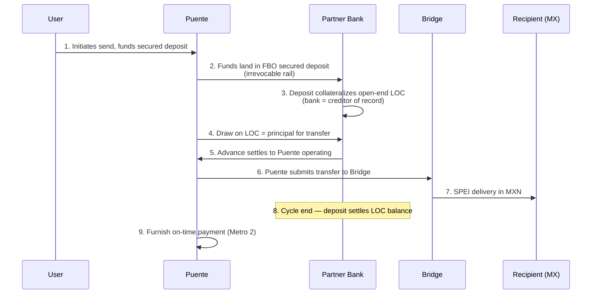

# Puente — Bank Partnership Strategy

**Prepared:** August 12, 2026
**Owners:** Joshua Phelps + cofounder (outreach split)
**Status:** Working draft. Assumptions marked **[ASSUMPTION]** need your redline.

---

## 0. Read this first — the regulatory ground shifted three months ago

On **May 19, 2026**, an executive order titled *"Restoring Integrity to America's Financial System"* was signed. I verified this directly against primary legal analysis rather than relying on secondary reporting. It matters more to your bank search than any individual bank's status, because it targets the exact thing you're building.

What it directs:

| Deadline | Agency | Directive |
|---|---|---|
| ~mid-July 2026 | Treasury / FinCEN | Advisory naming red flags for non-work-authorized populations, explicitly including *"use of an ITIN to obtain credit products or open depository accounts where the applicant lacks verified lawful immigration status"* |
| ~mid-July 2026 | CFPB | Clarify that potential deportation and wage loss are ability-to-repay factors under TILA, and that lenders **may** consider them in underwriting |
| ~mid-July 2026 | Banking regulators | Guidance on managing credit risk from the non-work-authorized population |
| ~mid-Aug 2026 | Treasury + regulators | Propose CDD rule changes allowing institutions to obtain *"information relevant to immigration status"* |
| ~mid-Nov 2026 | Treasury + regulators | Propose CIP changes addressing foreign consular ID (matrícula consular) risk |

It is **risk-based, not a ban**. ITIN accounts are not prohibited. But the practical effect is already visible: American Banker has documented a sharp rise in unexplained account closures since December 2025, and consumer advocates report some banks now defensively refusing to open accounts for customers without SSNs — ahead of the formal rules even landing.

**Three consequences for your strategy:**

1. **Every first call now opens with ITIN risk appetite.** Not product fit, not economics. Banks are actively re-underwriting their tolerance for your exact demographic right now, independent of anything about Puente. Ask it first so you stop wasting cycles on banks that will say no in month four.

2. **Your FBO instinct is now worth much more than when you raised it.** Under FBO, the bank never onboards thousands of ITIN customers — it opens one account for Puente and you carry CIP. In the current climate that is the difference between a hard no and a conversation. **Lead with FBO in every pitch.**

3. **The strongest strategic option is one you haven't considered: sequence SSN-first.** Launch with the SSN-holding thin-file cohort, prove the program, and expand to ITIN once the CDD and CIP rulemakings resolve (roughly Q4 2026–Q1 2027). This makes every bank conversation dramatically easier during the exact window you need to close one. The honest cost is that it defers the users who need you most, and that's a real mission tension — your call, not mine. But you should make it deliberately rather than discover it in month five when a bank's credit committee balks.

Note the timing: the CDD rulemaking proposal was due roughly **this week**. Check FinCEN directly before any outreach goes out.

*Sources: [Mayer Brown](https://www.mayerbrown.com/en/insights/publications/2026/05/president-trump-signs-executive-order-directing-federal-financial-regulators-to-address-risks-to-us-financial-system-presented-by-customer-immigration-status), [American Banker on account closures](https://www.americanbanker.com/news/as-banks-close-accounts-experts-point-to-immigration-crackdown)*

---

## 1. The structure, as I understand it

A Chime-Credit-Builder-shaped product where the remittance replaces the card purchase.

1. User funds a secured deposit account. Collateral sits at the partner bank, ideally in an FBO/omnibus account titled to Puente, with Puente maintaining the sub-ledger.
2. That balance secures an **open-end line of credit issued by the partner bank in the user's name**. Bank is creditor of record.
3. The line funds the USD→MXN remittance. Puente routes delivery via Bridge (licensed MTL holder), Stripe collects USD today.
4. At cycle end the deposit settles the balance.
5. On-time repayment is furnished to the bureaus as a tradeline. Metro 2, account type 18.
6. Puente services, furnishes, and owns the consumer relationship. Revenue: monthly subscription + FX margin. **No interest charged.**

**What this means legally:** Puente is both a servicer of consumer revolving credit and an FCRA §623 furnisher. Reg Z open-end disclosures, ECOA/Reg B adverse action, and furnisher accuracy duties all apply. No interest means rate exportation and usury are largely non-issues — **ignore charter-state selection as a targeting criterion.** One asterisk: a mandatory subscription fee can be recharacterized as a finance charge, and may count toward the Military Lending Act's 36% MAPR for covered borrowers. Counsel question, not a blocker, but have an answer ready.

---

## 2. Flow of funds — strawman for redline

**Assumptions to confirm or kill:**

- **[ASSUMPTION]** Funding is irrevocable before the draw is released. If funding arrives by ACH, the 60-day consumer return window leaves the line unsecured — see §3.
- **[ASSUMPTION]** Cycle length is monthly. Chime-style. Not confirmed with you.
- **[ASSUMPTION]** Credit limit equals deposited collateral, 1:1. No unsecured headroom at launch.
- **[ASSUMPTION]** Bank is furnisher of record OR Puente furnishes as servicer — **you haven't decided this and it has a 6+ month lead time.** See §5.
- **[ASSUMPTION]** Bridge remains the delivery rail and the partner bank touches only the deposit and credit legs, not the cross-border leg. This is a meaningful simplification for the bank and worth stating explicitly in the pitch.
- **[ASSUMPTION]** Stripe's role changes. Today Stripe collects USD for the transfer; here funds must land in a bank-held secured deposit before the draw. **This is a real change to a flow you've already built** and needs mapping.

---

## 3. Funding rails — the decision that makes "fully secured" true or false

Your entire pitch is "this line is fully collateralized, your credit exposure is near zero." That's only true if the collateral can't be clawed back after the remittance leaves.

| Rail | Network cost | Finality | Verdict |
|---|---|---|---|
| ACH (Stripe) | Cheapest | **60-day consumer dispute window**, disputes final and uncontestable, T+4 (T+2 if eligible) | Worst fit. A 60-day hole in your collateral |
| Debit push/pull | Interchange + fees | Chargeback exposure | Better than ACH, still revocable |
| **RTP** | $0.045/transfer at network level, no monthly minimums | **Irrevocable** | Best fit |
| **FedNow** | $0.045/transfer; $25/mo per RTN waived to $0 in 2026 | **Irrevocable** | Best fit |

**The $0.045 is what banks pay, not what you'll pay.** Your partner's markup is the negotiable number. For calibration, Increase publishes RTP and FedNow origination at **$2.50/txn** — the only transparent public pricing found in the entire sector. Treat $0.045 as the floor you negotiate toward, and make any partner quote it explicitly.

**Look at Stripe Instant Bank Payments (Link) before building anything new.** Instant confirmation with **bank-initiated returns guaranteed by Stripe**. You're already on Stripe. That may solve most of this without a new rail or partner. Caveat: Link-only, and the guarantee covers bank-initiated returns, not customer fraud disputes.

*Sources: [FedNow 2026 fee schedule](https://www.frbservices.org/resources/fees/fednow-2026), [Increase pricing](https://increase.com/pricing), [Stripe ACH docs](https://docs.stripe.com/payments/ach-direct-debit)*

---

## 4. Delinquency — honest, and cheap

Separate **"a user can never be late"** from **"users are almost never late."** You want the second. The first is a UDAAP and furnisher-accuracy problem, and your own compliance-reviewer already flags it: cycle logic that decouples reported status from actual events.

Your real exposure window is narrow and specific: funding fails or reverses after the remittance is gone. That's enough to build an honest product on.

- **Graduated trust.** New users: hold the transfer until funding is final. Seasoned users with clean history: release instantly and front the funds. Exposure exists only across proven users, on irrevocable rails, at limits you control.
- **Low initial limits, graduated up.** Loss = fronted amount × reversal rate × unrecovered share. With low limits and RTP-class finality that number is small *and modelable*.
- **Bring the model to the bank.** "Our expected loss is X bps, here's the arithmetic" beats "there's no risk," which no credit committee believes.
- **Furnish what actually happened, both directions.** Suppressing a real late is a §623 violation. Manufacturing risk you don't have is pointless.
- **If late is genuinely impossible, say so in marketing.** Don't imply the user is being tested when they aren't. Credit-builder products have drawn regulatory attention for exactly that gap.

---

## 5. Bureau furnishing — decide this now, it has the longest lead time

You marked this undecided. It's the longest pole in the tent after the bank itself, and it's your core value proposition.

| Option | Lead time | Trade-off |
|---|---|---|
| Puente furnishes as servicer | 6+ months; bureaus screen hard on data quality | Full control of the product's core feature |
| Bank furnishes | Fastest | Your central feature depends on their systems and priorities |
| Vendor | Middle | Costs margin, adds a dependency |

**Ask every bank and BaaS candidate on the first call whether furnishing is bundled** — several lending platforms include it, which would eliminate this vendor category entirely.

If you do need a vendor: **BureauRelay (Switch Labs)** publishes startup-shaped tiers (~$29/mo at 1,000 records, API access) — by far the most accessible entry point found. **Bloom Credit** is the enterprise-credible name if investor optics matter, but pricing is unpublished and it's a heavier sales lift. Note: **Nova Credit is not a furnishing service** — it translates foreign credit files into US-readable scores. Not relevant to furnishing, but potentially very relevant to you later as an underwriting signal for LATAM immigrants with home-country credit history.

---

## 6. The three tracks

### Track 1 — Program banks (speed)

Banks already running fintech programs. Fastest to live, most competition for attention.

**Lead targets:**

- **Sunrise Banks (St. Paul, MN)** — the standout. CDFI-certified, B Corp, and **already the issuing bank behind Self Financial's Credit Builder** (278,000+ loans, $249.7M originated in 2023) — structurally near-identical to your mechanic. Also runs **Pathway2Home**, an ITIN mortgage program. Mission fit, product precedent, and ITIN comfort in one institution. This is call #1. *Contact: fintech partnerships form at sunrisebanks.com, 844-786-5600.*
- **Academy Bank** — powers **Atlas**, a credit-building fintech, and built **explicit ITIN onboarding workflows and a Spanish-language product version** for that partnership. Atlas's structure is tiered/partially-secured credit lines with a secured deposit unlocking higher limits. The closest ITIN + secured-credit precedent found anywhere. Also publicly screens for partners with "sustainable revenue models" rather than interchange/yield dependence — **your subscription + FX model is exactly what they say they want.**
- **Continental Bank (Salt Lake City)** — Utah industrial bank, does both deposit programs **and revolving lines of credit**, markets 120-day onboarding and "direct access to decision-makers." Local to you. Strong second call.
- **Thread Bank (TN)** — FDIC consent order terminated December 2025, so clean now. Has a named SVP of Fintech Partnerships. Ask what triggered the order and what changed.
- **First Century Bank (TN)** — also a Self Financial issuing bank, so the literal precedent is there, but likely conflicted with a direct competitor. One exploratory call; raise the conflict up front.

**On FinWise, where you've already reached out:** likely a no on fit, not compliance. Their own EVP has publicly said they reject roughly 12–18 applicants per acceptance, specifically citing companies "not big enough," and they've pivoted to ~90% commercial. Clean regulatory record, wrong size appetite. Don't over-invest.

**Do not spend time on:** Evolve (active Fed C&D, Synapse epicenter), Lineage (second active FDIC order June 2026, being pushed out of BaaS by its regulator), Mode Eleven (voluntarily exited), Sutton (active BSA/AML order — worst possible pairing with an ITIN-heavy base). **Cross River** is nuanced: active FDIC fair-lending consent order *and* it sponsors Común, a Hispanic-immigrant fintech. Not a clean avoid, but not a lead.

### Track 2 — Middleware (speed to market)

- **Synctera** — best architectural match found. They document a **`CHARGE_SECURED` primitive**: an open-end, non-revolving credit account where a linked security deposit's balance mechanically caps available credit. Fund $100 → $100 credit; spend $20 → both drop. That is your product. Raised $15M in 2026, actively expanding. **Open question: can that primitive be decoupled from a card rail to fund a remittance directly, and does it furnish to bureaus?** First call.
- **Treasury Prime** — large and credible ($100B+ 2025 volume, 100+ fintechs, GC testified to House Financial Services in May 2026). Consumer lending APIs claimed. No confirmed funding since 2023 — ask directly whether that's profitability or constraint.
- **Column N.A.** — a chartered bank operating as a direct API. Healthiest financials in the sector (~$153M 2025 revenue, founder-owned, no outside investors). Confirmed RTP + FedNow. Lending infrastructure skews commercial/warehouse; unverified for consumer secured lending at your size.
- **Increase** — probably not your lending partner (their credit products are institutional capital-call lines), but the best-priced instant rail and the only transparent pricing in the sector. Candidate for the settlement leg.
- **Astra** — instant disbursement across RTP, FedNow, Visa Direct, explicitly marketed to lenders. Complement, not a bank.

**Avoid:** Solid (Chapter 11, liquidated Nov 2025), Synapse (bankrupt, depositor shortfall unresolved). **Unit** — has the right lending primitives on paper, but no confirmed funding or health signal since 2022–23 and their docs frame lending as business-purpose. Don't build a multi-year furnishing relationship on an opaque counterparty.

**Note:** you may end up with a two-vendor stack — one partner for the deposit + secured credit legs, another (Increase or Astra) for the instant settlement rail.

### Track 3 — CDFIs and MDIs (durable + narrative)

Structural point that saves you time: **banks have no field-of-membership restriction; credit unions do.** Latino Community CU is NC-only despite marketing that implies otherwise. Guadalupe CU is seven New Mexico counties. Hope CU is six states. Self-Help FCU spans six states. **For a nationwide product, prioritize CDFI/MDI banks over credit unions** regardless of mission fit. Whether an FBO/omnibus relationship sidesteps NCUA FOM rules is genuinely unresolved — counsel question if you want to pursue a CU.

- **Sunrise Banks** — spans Track 1 and Track 3. Start here.
- **Ponce Bank (Bronx)** — dual CDFI + MDI (fewer than 40 US banks hold both), founded by Puerto Rican migrants, majority Spanish-speaking staff, tech-forward leadership. No confirmed BaaS program yet — would be a build. Best brand fit after Sunrise.
- **Spring Bank (Bronx)** — CDFI, B Corp, CDBA member, has its own credit-builder loan product. Institutional comfort with the mechanic.
- **Self-Help Federal CU** — already offers both an **"Immigration Loan"** and a **CreditBuilder Loan**. Extraordinary catalog alignment, no fintech infrastructure. Six states.

**Network intro paths — these are your substitute for warm intros:**

- **NBA MDI ConnectTech** (National Bankers Association + Alliance for Innovative Regulation + Inclusiv, funded by Visa) — a formal, multi-year fintech↔MDI matchmaking program. The single most structured channel found. *202-588-5432, strategic partner form at nationalbankers.org*
- **Inclusiv / Juntos Avanzamos** — 167+ designated credit unions across 34 states serving Hispanic communities. *juntosavanzamos@inclusiv.org*
- **CDBA** — trade association for CDFI banks. Peer Forum ran June 2026; watch for 2027.
- **OFN** — launched an Innovation Council and Capital Solutions Accelerator in 2026.

---

## 7. Cold outreach plan

You have no investors, advisors, or board. That's the real constraint — list quality doesn't fix it. Ranked by yield per dollar:

**1. ICBA ThinkTECH Accelerator — apply now.** Free, non-dilutive, explicitly built to put early-stage fintechs in front of hundreds of community bank executives via demo days, 1:1s, and ICBA LIVE exposure. ~6 companies per cohort, 150+ alumni including Alkami and Sardine. **Next cohort January 2027**, rolling applications via F6S. *Contact: Pierce Sloan, Pierce.Sloan@icba.org.* This is the highest-value single action available to you.

**2. Plug and Play Inclusive Fintech Accelerator (with Visa).** Explicitly targets diverse founders building inclusive fintech; past cohorts included Latinx and immigrant-focused products. Facilitated 300+ financial-institution intros in cohort 2. Timing for the next cohort unconfirmed — watch and apply.

**3. Utah Bankers Association — AI-Native Banking and Fintech Conference, September 29, 2026, Salt Lake City.** Six weeks out, in your city, and Utah has the highest concentration of fintech-partner industrial banks in the country. The one dated, verified local opportunity. Register.

**4. Money20/20, October 18–21, 2026, Las Vegas.** Early Stage Startup Pass **$1,545** (requires live product, <3 years incorporated, <$5M raised — you likely qualify). Relationship-building, not deals. **Fintech Meetup** (historically March) has a $1,495 startup pass and a software-matched 1:1 meeting system, which is structurally better for actual meetings than booth-wandering.

**5. Consultants — buy a diligence review, not a retainer.** Firms exist (Fintech2Bank, led by an ex-WebBank/Axos CEO; Fraxtional, which claims pre-qualified bank introductions; FS Vector). None publish pricing. At your stage the right ask is a short paid readiness review, and the specific qualifying question is: **"do you have a live relationship with a bank currently serving ITIN customers?"** That's the only thing they can offer that you can't do yourself.

**Tactics that are actually evidenced:**

- **Run it as a parallel RFP, not sequential asks.** Creates leverage and quickly reveals who responds to inbound at all.
- **Target Stage 1–2 banks** (new to sponsorship, or aggressively growing) rather than mature ones. Mature banks prioritize by deal size and investor backing — you lose that filter.
- **Open with a real comparable.** "You already sponsor Self Financial, whose structure matches ours" or "you built ITIN workflows for Atlas" is categorically different from generic cold outreach, even with zero personal connection. This is the single highest-leverage tactic found.
- **Put your compliance officer in the first email**, with a one-page CMS summary attached. Most two-founder inbound doesn't have one. It's your best differentiator.
- **Address the immigration climate proactively.** Every bank will ask. Arrive with the answer.

---

## 8. Bank-ready package

Assemble before outreach, not during. Banks request most of this in early diligence, and having it ready is itself a signal.

- [ ] Program description — company, org chart, funding, target customer, product, onboarding walkthrough
- [ ] **Flow of funds diagram** (see §2 — redline the strawman)
- [ ] Financials — cash, burn, funding sources, projections (2yr historical + 3yr projected is a common gate)
- [ ] Corporate docs — DE C-corp formation, beneficial ownership 25%+, litigation disclosures, insurance (GL, E&O, D&O, cyber)
- [ ] **CMS summary** — named compliance officer, reporting lines, board-approved policies
- [ ] **BSA/AML program** — CIP and CDD procedures **specifically addressing ITIN verification**. This will get the most scrutiny of anything in the package. Do not gloss it.
- [ ] Sanctions/OFAC screening, SAR procedures, transaction monitoring approach
- [ ] Vendor management — Bridge (MTL, FX, payout, identity), Stripe (USD intake + identity verification), Persona (via Bridge, fallback identity), Twilio (via Supabase), furnishing vendor when one exists: diligence records, audit rights, monitoring. *(Sumsub was named here historically and was never integrated — see decisions.md.)*
- [ ] Formal risk assessment — ML, fraud, credit, reputational, concentration
- [ ] Training program and independent testing plan
- [ ] BCP / incident response
- [ ] Marketing compliance review process (fair lending, UDAAP, **Spanish parity on legally operative text**)

**Two assets to lead with that most seed companies lack:** your in-house compliance officer, and your existing double-entry ledger with reconciliation runbooks and derived-not-stored balances. The second one matters more than you'd think — FBO-with-fintech-maintained-ledger is precisely the structure that failed in Synapse, and bank compliance teams now scrutinize it hard. You can show them yours works.

---

## 9. Open items

**Decisions you owe:**
- SSN-first vs. ITIN-from-launch sequencing (§0.3) — the highest-stakes call in this document
- Furnishing path (§5) — longest lead time
- Funding rail, including whether Stripe Instant Bank Payments solves it (§3)
- Cycle length and initial credit limits

**Verify before outreach:**
- FinCEN advisory and CDD NPRM status — both were due by now
- Live consent-order status for every bank on the list, via [FDIC](https://orders.fdic.gov) and [OCC](https://apps.occ.gov/EASearch/) enforcement databases. Re-check immediately before contact, not from this doc
- Whether Grasshopper's pending acquisition by Enova affects any partner routing through it

**Could not verify from public sources:** no bank or platform publicly states its ITIN onboarding policy. Not one. This has to be your first diligence question on every call — it cannot be screened in advance.
