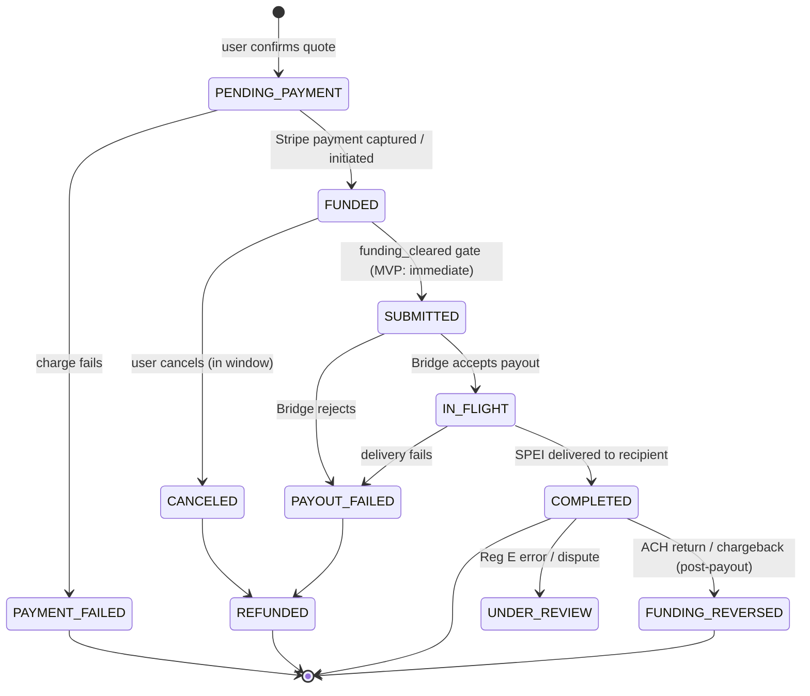
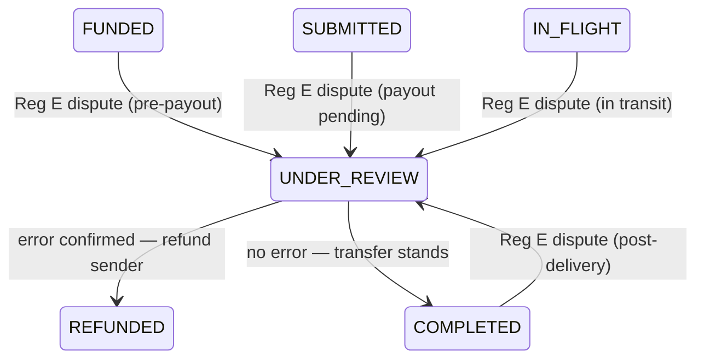

# Transfer State Machine — USD → MXN Remittance

**Date:** 2026-06-25
**Status:** v1 draft for review

The lifecycle of a single remittance transfer, from an accepted quote to delivery (or refund).
This is the spine of the system — the queue drives these transitions, the ledger posts on them,
and Reg E obligations attach to them. Illegal transitions must be unrepresentable in code.

A **quote** is a separate, expirable entity (see ERD). A `transfer` row is created only when the
user confirms a quote, entering the machine at `PENDING_PAYMENT`.

## Diagram

`UNDER_REVIEW` (Reg E error resolution) can also be opened from `FUNDED`, `SUBMITTED`, and
`IN_FLIGHT`, not just `COMPLETED`; shown once above for diagram clarity.

### UNDER_REVIEW exit paths

Two exits only:

- **`REFUNDED`** — error is confirmed at any stage. Pre-delivery: transfer is stopped and funds
  returned. Post-delivery (`COMPLETED` entry): correction payment issued to sender. The ledger
  treatment differs by entry point (see ledger rules doc), but the state is the same.
- **`COMPLETED`** — investigation finds no error; the transfer was correct. If opened from a
  pre-delivery state and the payout has since completed, ops closes the review and the transfer
  settles normally. If the payout is still in flight, ops allows it to proceed before closing.

`UNDER_REVIEW` is never self-resolving — a human ops action sets the exit transition. The ops
console must enforce that only these two exits are available, so the state machine stays closed.

**Ledger note:** `UNDER_REVIEW → REFUNDED` from a post-delivery entry point is a *correction
payment* (new debit against Puente), not a reversal of the original entries. The original
`COMPLETED` ledger entries remain intact. Detail lives in the ledger rules doc.

## States

| State | Meaning | Terminal? |
|---|---|---|
| `PENDING_PAYMENT` | Transfer created from an accepted quote; collecting funds via Stripe. Reconciliation job marks `PAYMENT_FAILED` if no Stripe webhook arrives within 30 min. | no |
| `FUNDED` | Stripe payment captured (card) or initiated (ACH). `funding_cleared` flag tracked here. | no |
| `SUBMITTED` | Payout request sent to Bridge with an idempotency key. | no |
| `IN_FLIGHT` | Bridge is executing the FX + SPEI payout. | no |
| `COMPLETED` | Recipient credited at their CLABE. | ✅ success |
| `PAYMENT_FAILED` | Stripe charge failed; no funds collected. Terminal — no retry against this transfer. User returns to the quote screen; a new quote + new transfer is required. | ✅ |
| `CANCELED` | User canceled while still pre-delivery; triggers refund. | → REFUNDED |
| `PAYOUT_FAILED` | Bridge could not deliver (bad CLABE, bank reject); triggers refund. | → REFUNDED |
| `REFUNDED` | Funds returned to sender (from CANCELED, PAYOUT_FAILED, or UNDER_REVIEW). | ✅ |
| `FUNDING_REVERSED` | ACH return / card chargeback **after** payout — our loss/recovery path. | ✅ (ops) |
| `UNDER_REVIEW` | Reg E error-resolution / dispute open; exits to `REFUNDED` or `COMPLETED` only. | no |

## The `funding_cleared` gate (the key MVP decision)

The `FUNDED → SUBMITTED` transition is guarded by a per-transfer `funding_cleared` flag plus a
policy setting:

- **MVP policy (now):** `WAIT_FOR_CLEARING = false`. We submit to Bridge as soon as the payment is
  captured/initiated, accepting funding-reversal risk because users are ~5 trusted people. The
  `funding_cleared` field still exists and is recorded; we just don't block on it.
- **Later policy:** `WAIT_FOR_CLEARING = true`. `FUNDED → SUBMITTED` requires `funding_cleared = true`
  (ACH settled). Flipping the policy flag is the only change — no structural rework.
- **The gate is the mechanism; the risk engine is the policy.** Later, `WAIT_FOR_CLEARING` stops being
  one global flag and becomes a **per-transfer verdict from the risk engine** (user tenure, amount,
  velocity, account-verification signals) — instant for seasoned trusted users, hold-for-clearing for
  new/large/risky transfers. The gate code is unchanged; it reads a per-transfer decision instead of a
  constant.
- **Float ceiling (MVP guardrail, live now):** the instant policy fronts cash before ACH clears, so
  cap the **aggregate outstanding `funding_receivable`**. Block `FUNDED → SUBMITTED` when fronting
  this transfer would push total fronted float past a configured ceiling. The ledger already computes
  that number; this bounds a bug or bad actor from running exposure unbounded. It's the one risk
  control we turn on from day one — everything else in the risk engine is "later."

This is a config flag, not an architecture. Same philosophy as the funding-source abstraction.

## Cancellation window (Reg E)

The 30-minute cancellation right applies only while funds are **not yet delivered**. Because payouts
are near-instant, the practical window is "until `COMPLETED`," often seconds.

- **Clock starts at payment, not at funding clearing.** The 30-min window runs from when the sender
  pays. With ACH (clears in days), the window closes long before funding clears — a user effectively
  **cannot "cancel after clearing."** Cancellation and ACH clearing are different timelines.
- **Cancellation is low-risk:** it is always pre-delivery, so we refund money we still hold — we never
  lose funds to a cancellation. The real exposure is post-delivery ACH returns (see Funding reversal).
- **Cancelable only in `FUNDED`** (before we hand off to Bridge), within 30 min of payment. Once
  `SUBMITTED` to an instant rail we cannot reliably recall it, so a cancel request after submission
  resolves via **error resolution** (`UNDER_REVIEW`), not cancellation. Disclosure wording must say
  cancellation is available until the transfer is submitted for payout — *flag for counsel*.
- **The button is never the control.** Enabling/disabling cancel in the UI is cosmetic; the API
  re-checks cancelable state on every request. A small UI window is not a vulnerability — server-side
  enforcement is.
- **Guard the race atomically.** Cancel and payout-submission contend for the same `transfer` row:
  take a row lock / optimistic-concurrency guard so `FUNDED → CANCELED` commits only if the row is
  still `FUNDED`, and submission commits only if still `FUNDED`. One wins — no refund-and-deliver
  double-spend (TOCTOU).
- We must still **disclose** the right (receipt/disclosure) even when it expires instantly.
- **Peer practice (Remitly, Wise):** offer the mandatory 30-min right, tie cancelability to "not yet
  paid out," refund fees + taxes within 3 business days; some add a longer courtesy window while
  pending. Our model matches this.
- The protection that survives delivery is **error resolution** (§1005.33) → `UNDER_REVIEW`, a
  separate path from cancellation.

## Idempotency & retries

- Every external call that moves money carries an **idempotency key** keyed to the transfer +
  transition, so the worker can retry safely: `FUNDED → SUBMITTED` (Bridge payout), refunds, and
  `PENDING_PAYMENT → FUNDED` (Stripe capture).
- Transitions are driven by the Postgres queue with the transactional-outbox pattern: the state
  change and the "do the next step" job commit in the same DB transaction.
- Webhooks (Stripe, Bridge) are the source of truth for `FUNDED`, `IN_FLIGHT`, `COMPLETED`,
  `PAYOUT_FAILED`; handlers are idempotent (providers redeliver).

## Ledger hooks (detail lives in ledger-rules doc)

- `FUNDED` — debit user funding source, credit Puente clearing.
- `SUBMITTED`/`IN_FLIGHT` — move from clearing to Bridge payable; recognize Puente fee.
- `COMPLETED` — settle payable.
- `CANCELED` / `PAYOUT_FAILED` → `REFUNDED` — reverse the funding entries.
- `FUNDING_REVERSED` — book a receivable/loss against the user (recovery).

Every transition writes an **audit log** entry. Balances are derived from ledger entries, never stored.

## Funding reversal — now vs later

ACH returns / unauthorized disputes can arrive up to **~60 days** post-delivery; fraudulent returns
are largely unrecoverable (industry recovery ~25%). This is the real risk of ACH + instant payout —
accepted now because users are trusted.

- **Now (MVP):** detect the return (NACHA return code / Stripe event) → set `FUNDING_REVERSED` →
  manual ops: contact user, book a receivable, recover or write off.
- **Later (risk engine):**
  - **Verify at funding** — bank ownership + name match + balance check (e.g. Plaid) before `FUNDED`.
  - **Gate delivery by risk** — flip `WAIT_FOR_CLEARING = true` (or hold part of the return window)
    for new / large / high-risk transfers; keep instant for seasoned, trusted users.
  - **Limits & holds** — first-transfer holds, per-user / velocity caps, amount tiers.
  - **Automated recovery** — re-present eligible returns (e.g. R01 NSF), dunning, account freeze,
    block further sends, collections.
  - **Reserves** — provision for expected loss.
  - **Rail mix** — card / RTP / instant-debit as a lower-return-risk option (card brings chargebacks
    instead).

## Resolved decisions (2026-06-25)

1. **Cancel UX:** disclosure of the cancellation right (on the receipt) is mandatory. The cancel
   *action* is available only while pre-delivery (`FUNDED` / `SUBMITTED`) — naturally brief with
   instant payout. Don't over-build the UX. Matches Remitly/Wise.
2. **`FUNDING_REVERSED`:** manual ops/recovery for MVP. Risk engine (above) comes later.
3. **Funding rail:** **ACH first, card second.** Accepts the ~60-day ACH return exposure (fine at
   trusted-user scale; neutralized later by the `funding_cleared` gate + risk engine).
