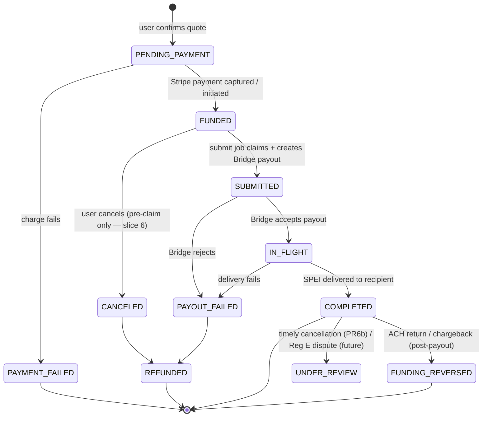
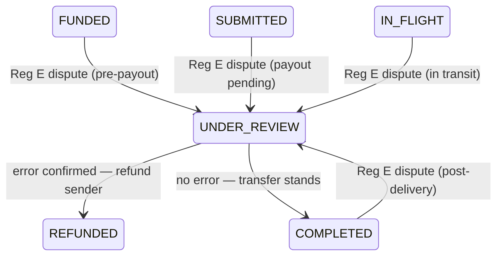

# Transfer State Machine — USD → MXN Remittance

**Date:** 2026-06-25 · **Updated:** 2026-07-28 (slice 7 PR6b — post-submission cancellation record + both resolution tails; PR6b-0 refund claim)
**Status:** v2 — matches the slice-5 implementation

The lifecycle of a single remittance transfer, from an accepted quote to delivery (or refund).
This is the spine of the system — the queue drives these transitions, the ledger posts on them,
and Reg E obligations attach to them. Illegal transitions must be unrepresentable in code.

A **quote** is a separate, expirable entity (see ERD). A `transfer` row is created only when the
user confirms a quote, entering the machine at `PENDING_PAYMENT`.

## Diagram


```mermaid
stateDiagram-v2
    [*] --> PENDING_PAYMENT: user confirms quote
    PENDING_PAYMENT --> FUNDED: Stripe payment captured / initiated
    PENDING_PAYMENT --> PAYMENT_FAILED: charge fails
    FUNDED --> SUBMITTED: submit job claims + creates Bridge payout
    FUNDED --> CANCELED: user cancels (pre-claim only — slice 6)
    SUBMITTED --> IN_FLIGHT: Bridge accepts payout
    SUBMITTED --> PAYOUT_FAILED: Bridge rejects
    IN_FLIGHT --> COMPLETED: SPEI delivered to recipient
    IN_FLIGHT --> PAYOUT_FAILED: delivery fails
    CANCELED --> REFUNDED
    PAYOUT_FAILED --> REFUNDED
    COMPLETED --> FUNDING_REVERSED: ACH return / chargeback (post-payout)
    COMPLETED --> UNDER_REVIEW: timely cancellation (PR6b) / Reg E dispute (future)
    PAYMENT_FAILED --> [*]
    REFUNDED --> [*]
    COMPLETED --> [*]
    FUNDING_REVERSED --> [*]
```

`UNDER_REVIEW` (Reg E error resolution) can also be opened from `FUNDED`, `SUBMITTED`, and
`IN_FLIGHT`, not just `COMPLETED`; shown once above for diagram clarity.

**As implemented, there is exactly ONE writer of `UNDER_REVIEW`: the cancellation COMPLETED tail
(slice 7 PR6b, below).** The dispute paths in this section are design, not code — no `disputes` table
exists and `POST /:id/disputes` is deliberately out of scope. Do not read the two as the same
mechanism: §1005.34 cancellation is not §1005.33 error resolution, and conflating them puts the sender
on the wrong clock.

### UNDER_REVIEW exit paths


```mermaid
stateDiagram-v2
    FUNDED --> UNDER_REVIEW: Reg E dispute (pre-payout)
    SUBMITTED --> UNDER_REVIEW: Reg E dispute (payout pending)
    IN_FLIGHT --> UNDER_REVIEW: Reg E dispute (in transit)
    COMPLETED --> UNDER_REVIEW: Reg E dispute (post-delivery)
    UNDER_REVIEW --> REFUNDED: error confirmed — refund sender
    UNDER_REVIEW --> COMPLETED: no error — transfer stands
```

Two exits only:

- **`REFUNDED`** — error is confirmed at any stage. Pre-delivery: transfer is stopped and funds
  returned. Post-delivery (`COMPLETED` entry): correction payment issued to sender. The ledger
  treatment differs by entry point (see ledger rules doc), but the state is the same.
- **`COMPLETED`** — investigation finds no error; the transfer was correct. If opened from a
  pre-delivery state and the payout has since completed, ops closes the review and the transfer
  settles normally. If the payout is still in flight, ops allows it to proceed before closing.

`UNDER_REVIEW` is never self-resolving — a human ops action sets the exit transition. The ops
console must enforce that only these two exits are available, so the state machine stays closed.

**Ledger note:** `UNDER_REVIEW → REFUNDED` from a post-delivery entry point is a *correction
payment* (new debit against Puente), not a reversal of the original entries. The original
`COMPLETED` ledger entries remain intact. Detail lives in the ledger rules doc.

## States

| State | Meaning | Terminal? |
|---|---|---|
| `PENDING_PAYMENT` | Transfer created from an accepted quote; collecting funds via Stripe. Reconciliation job marks `PAYMENT_FAILED` if no Stripe webhook arrives within 30 min. | no |
| `FUNDED` | Stripe payment captured (card) or initiated (ACH). `funding_cleared` flag tracked here. May carry a `payout_hold_reason` (see Payout holds) — a held transfer stays `FUNDED` until ops releases it. | no |
| `SUBMITTED` | Payout request sent to Bridge with an idempotency key. | no |
| `IN_FLIGHT` | Bridge is executing the FX + SPEI payout. | no |
| `COMPLETED` | Recipient credited at their CLABE. | ✅ success |
| `PAYMENT_FAILED` | Stripe charge failed; no funds collected. Terminal — no retry against this transfer. User returns to the quote screen; a new quote + new transfer is required. | ✅ |
| `CANCELED` | User canceled while still pre-delivery; triggers refund. | → REFUNDED |
| `PAYOUT_FAILED` | Bridge could not deliver (bad CLABE, bank reject); triggers refund. | → REFUNDED |
| `REFUNDED` | Funds returned to sender (from CANCELED, PAYOUT_FAILED, or UNDER_REVIEW). | ✅ |
| `FUNDING_REVERSED` | ACH return / card chargeback **after** payout — our loss/recovery path. | ✅ (ops) |
| `UNDER_REVIEW` | Reg E error-resolution / dispute open; exits to `REFUNDED` or `COMPLETED` only. | no |

## The `funding_cleared` gate (the key MVP decision)

The `FUNDED → SUBMITTED` transition is guarded by a per-transfer `funding_cleared` flag plus a
policy setting:

- **MVP policy (now):** `WAIT_FOR_CLEARING = false`. We submit to Bridge as soon as the payment is
  captured/initiated, accepting funding-reversal risk because users are ~5 trusted people. The
  `funding_cleared` field still exists and is recorded; we just don't block on it.
- **Later policy:** `WAIT_FOR_CLEARING = true`. `FUNDED → SUBMITTED` requires `funding_cleared = true`
  (ACH settled). Flipping the policy flag is the only change — no structural rework.
- **The gate is the mechanism; the risk engine is the policy.** Later, `WAIT_FOR_CLEARING` stops being
  one global flag and becomes a **per-transfer verdict from the risk engine** — the gate code is
  unchanged; it reads a per-transfer decision instead of a constant. The full risk-engine roadmap
  (verify-at-funding, risk-gated delivery, limits, recovery, reserves, rail mix) lives under
  **Funding reversal — now vs later** below — not restated here.
- **Float ceiling (crude aggregate version, live in slice 5):** the instant policy fronts cash
  before ACH clears, so the submit job checks the **aggregate `funding_receivable` balance** (the
  ledger already computes it) against the `FLOAT_CEILING_MINOR` env cap before creating a Bridge
  payout. A trip leaves the transfer `FUNDED` with **no hold** — self-healing backpressure: the
  1-min sweep retries as the balance drains, and a fingerprinted Sentry alert fires (no spam,
  nothing for ops to release; see [runbooks/payout-holds.md](runbooks/payout-holds.md)). This
  bounds a bug or bad actor from running exposure unbounded — the one risk control on from day
  one. Per-user **velocity** control landed early in slice 7 PR5 (confirm gate + `FUNDED → SUBMITTED`
  backstop); the per-user dollar-outstanding cap and the broader risk engine remain slice 8.

This is a config flag, not an architecture. Same philosophy as the funding-source abstraction.

## Immediate submission & the claim contract (slice 5)

**We submit to Bridge as soon as a transfer is `FUNDED`.** There is no 30-minute hold and no
cancel-window submission gate: the funding webhook enqueues `payout.submit(transferId)` on the
`PENDING_PAYMENT → FUNDED` transition, and the 1-min `payout.sweep` cron heals any lost enqueue.
`cancelable_until` stays recorded on the transfer, but as **disclosure metadata only** — it gates
nothing. (Why this is Reg E-sound is covered under Cancellation below and in
[decisions.md](decisions.md), 2026-07-20.)

### The submit claim

Before calling Bridge, the submit job **claims** the transfer with a guarded UPDATE:

```sql
UPDATE transfers SET submit_attempted_at = now()
WHERE id = $1
  AND state = 'FUNDED'
  AND payout_hold_reason IS NULL
  AND submit_attempted_at IS NULL
```

0 rows updated (and not a crash-recovery re-entry) means someone else won — the job stops. Crash
recovery: if `submit_attempted_at` is already set on entry, the job skips the guards and goes
straight to the idempotent Bridge re-POST (same idempotency key, byte-identical body → Bridge
returns the existing transfer) and the RPC transition. The sweep treats claims older than 10 min
with no `provider_transfer_ref` as stale and re-enqueues.

### The refund claim (slice 7 PR6b-0)

The `PAYOUT_FAILED → REFUNDED` tail has the same problem one step later — two runs (a poller re-drive
and an operator's `trigger-refund.ts`, or two webhook deliveries) both reading `refund_payment_ref IS
NULL` and both paying the sender. So it takes its own claim before calling the funding processor:

```sql
UPDATE transfers SET refund_claimed_at = now(), refund_claimed_by = $2
WHERE id = $1
  AND refund_payment_ref IS NULL
  AND refund_claimed_at IS NULL
```

0 rows means someone else owns the disbursement. One re-read then says which of three: the ref is now
set and the state settled (**nothing to do**), the ref is set but unsettled (**finish the state**), or
neither (**refuse** — `claim_taken` if the claim is live, `claim_abandoned` if it is over 30 minutes
old). A claim survives success: `refund_payment_ref` gates from there, and the stamp records when the
money left.

**A stale refund claim is the exact opposite of a stale submit claim, on purpose.** Submit recovers by
re-POSTing to Bridge, which dedupes on the idempotency key, so a stale claim is safely retaken by a
machine. Nothing gives the funding seam that guarantee — the mock processor ignores the key outright —
so an *abandoned* refund claim may mean the sender was already paid, and only a human checking the
processor can tell. It is never retaken automatically: ops confirms, then clears it via
`--reclaim` ([runbooks/manual-refund.md](runbooks/manual-refund.md)). Note there is also **no
release-on-throw**: a processor timeout and a processor rejection throw identically, so the claim is
left standing rather than handing the next run a green light. Full rationale in
[decisions.md](decisions.md) (2026-07-28).

### Contract for slice 6 (cancel) — binding

User cancel must be a guarded UPDATE with `state = 'FUNDED' AND submit_attempted_at IS NULL`
**before** its RPC transition. Row locking serializes claim vs cancel — one guarded UPDATE commits
first and the other matches 0 rows — so a Bridge-payout-exists-but-`CANCELED` race is
**structurally impossible**. Post-claim cancel requests follow the state-keyed refund rule below.

### Payout holds

A hold is not a state: it is `FUNDED` plus a `payout_hold_reason` (`fx_drift`, `payability`,
`submit_error`, or `velocity_review`) and `payout_held_at`. The submit job sets a hold and stops; the sweep skips held
rows; ops investigates and releases via [runbooks/payout-holds.md](runbooks/payout-holds.md)
(clear the column; the sweep resubmits within a minute).

- **`fx_drift`** — the FX submission backstop tripped: live Bridge buy rate drifted more than
  `FX_MAX_DRIFT_BPS` from the quote's `source_rate`, or the quote is older than
  `FX_MAX_QUOTE_AGE_MINUTES`. Never submit on unknown or dislocated rates.
- **`payability`** — destination or recipient not `active`, or no `provider_account_ref`.
- **`submit_error`** — Bridge rejected the payout with a non-retryable 4xx (422 idempotency
  mismatch or similar).
- **`velocity_review`** — the per-user velocity backstop tripped at `FUNDED → SUBMITTED`: a rare
  same-instant commit race slipped the confirm-time cap. Deliberately a hold, **not** a self-heal —
  a per-user velocity count doesn't drain on its own (a completed send keeps counting for the whole
  window), so ops must release (if legitimate) or cancel + refund rather than let it strand.

A float-ceiling trip is deliberately **not** a hold (self-healing — see the gate section above).

### Payout event mapping (webhook + poll, one processing path)

Bridge transfer events arrive via webhook (`POST /v1/webhooks/bridge`) and via the `payout.poll`
cron, which synthesizes the same event shape from `GET` responses. Both paths insert into
`payment_events` (deduped on `(source, external_event_id)`) and are processed by one job:

| Bridge signal | Transition |
|---|---|
| payout created (submit job, synchronous) | `FUNDED → SUBMITTED` (+ SUBMITTED ledger batch) |
| `payment_submitted` | `SUBMITTED → IN_FLIGHT` (no ledger) |
| `payment_processed` | `IN_FLIGHT → COMPLETED` (+ COMPLETED ledger batch; catches up through `IN_FLIGHT` if a webhook was missed) |
| `undeliverable` / `error` / `canceled` / `returned` / `refunded` / `refund_in_flight` | → `PAYOUT_FAILED` (refund postings are slice 6) |
| `refund_failed` | → `PAYOUT_FAILED` + **ops Sentry alert** — principal stuck at Bridge (stuck-transfer runbook) |
| `in_review` | no state change — poller alerts if >1h; a cancel request here is an ops runbook case |

Replays are RPC no-ops; out-of-order events are marked `ignored`.

## Cancellation window (Reg E)

What the law actually says (12 CFR §1005.34 + CFPB official interpretations, primary-source
research 2026-07-20): the sender's cancellation right runs 30 minutes from payment and **survives
until the funds are picked up or deposited** — there is NO exception for "already submitted to
partner," and no safe harbor. Our disclosure's "unless the funds have already been submitted for
payout" wording is therefore **stricter than the law allows** — already on the counsel list, and a
hard gate before slice-7 real money.

- **Clock starts at payment, not at funding clearing.** The 30-min window runs from when the sender
  pays. With ACH (clears in days), the window closes long before funding clears — a user effectively
  **cannot "cancel after clearing."** Cancellation and ACH clearing are different timelines.
- **The accepted tail (immediate payout, decision 2026-07-20):** a timely cancel while
  `SUBMITTED`/`IN_FLIGHT` legally requires a full refund even though Bridge payouts are
  uncancelable — a rare, bounded double-pay. Accepted because SPEI deposits in seconds (the right
  extinguishes almost immediately), the delay is not attacker-farmable, the 3-business-day refund
  window means the payout resolves first, and per-transfer limits cap the worst case. See
  [decisions.md](decisions.md).
- **Slice-6 refund rule, keyed to state:**
  - cancel at `FUNDED` (pre-claim) → normal cancel (`FUNDED → CANCELED → REFUNDED`);
  - cancel at `SUBMITTED`/`IN_FLIGHT` → **full refund within 3 business days** — wait for payout
    resolution first (if the payout fails, Bridge returns principal and the refund costs nothing);
  - cancel at `COMPLETED` → lawful denial (funds deposited; the right has extinguished);
  - cancel request while Bridge shows `in_review` → ops runbook case
    ([runbooks/payout-holds.md](runbooks/payout-holds.md)) — compliance holds can leave funds
    undeposited >1h, so contact Bridge before refunding.
- **The button is never the control.** Enabling/disabling cancel in the UI is cosmetic; the API
  re-checks cancelable state on every request. A small UI window is not a vulnerability — server-side
  enforcement is.
- **Guard the race atomically.** Cancel and payout-submission contend for the same `transfer` row —
  the submit claim and the slice-6 cancel contract (guarded UPDATEs on `state = 'FUNDED'` /
  `submit_attempted_at IS NULL`, above) are that guard. One wins — no refund-and-deliver
  double-spend (TOCTOU).
- We must still **disclose** the right (receipt/disclosure) even when it expires instantly.
- **Peer practice (Remitly, Wise):** offer the mandatory 30-min right, tie cancelability to "not yet
  paid out," refund fees + taxes within 3 business days; some add a longer courtesy window while
  pending. Our model matches this in product terms; the refund rule above is what keeps it lawful.
- The protection that survives delivery is **error resolution** (§1005.33) → `UNDER_REVIEW`, a
  separate path from cancellation.

## Idempotency & retries

- Every external call that moves money carries an **idempotency key** keyed to the transfer +
  transition, so the worker can retry safely: `FUNDED → SUBMITTED` (Bridge payout), refunds, and
  `PENDING_PAYMENT → FUNDED` (Stripe capture).
- Transitions are driven by pg-boss with **enqueue-after-commit + sweep healing**, not a
  transactional outbox (PostgREST RPC and pg-boss can't share a transaction): the state change
  commits, then the job is enqueued; jobs are idempotent replays, so a lost enqueue costs at most
  ~1 min of sweep latency, never correctness. See [decisions.md](decisions.md), 2026-07-20.
- Webhooks (Stripe, Bridge) are the source of truth for `FUNDED`, `IN_FLIGHT`, `COMPLETED`,
  `PAYOUT_FAILED`; handlers are idempotent (providers redeliver).

## Post-submission cancellation (slice 7 PR6b)

A cancel tapped at `SUBMITTED`/`IN_FLIGHT` — or at `FUNDED` after the submit job claimed the row —
cannot be honoured on the spot: the payout is already with Bridge. The API answers `202` and
**records** a `cancellation_requests` row. That row is EVIDENCE, not a movement; nothing posts to the
ledger while it is open.

**Timeliness is recorded, not enforced at the door.** The 202 fires on state alone and never consults
`cancelable_until`, so a cancel on a transfer stalled at `IN_FLIGHT` for days gets one too. The row
carries `within_window`, computed once inside the recording RPC and then frozen. Only a timely request
creates an automatic obligation.

The request resolves when the payout does, and what we owe differs by which way:

| Payout resolves as | What we owe | Mechanism |
|---|---|---|
| `PAYOUT_FAILED` | nothing extra — the refund tail already makes the sender whole | request closes `resolved_refunded` when the transfer reaches `REFUNDED` |
| `COMPLETED`, request in-window **and before the deposit** | a **full refund anyway** — the accepted, bounded double-pay, confined to the seconds-wide race | `COMPLETED → UNDER_REVIEW`, then a human runs the **correction payment** → `REFUNDED` |
| `COMPLETED`, request in-window but **after the deposit** | nothing — §1005.34's second condition failed at request time | **stays `COMPLETED`**; ops confirms the deposit time in the Bridge dashboard and denies with it as evidence |
| `COMPLETED`, request out of window | nothing | **stays `COMPLETED`**; ops is alerted and a human denies it on the record |

The deposit comparison uses our **earliest evidence** of it (the first `payment_processed` event's
`received_at`) so ambiguity breaks toward the sender: the true deposit happened at or before our
evidence, so the automatic path can over-route into review (a human then denies with Bridge's exact
timestamp) but can never deny a request the reg entitles.

`UNDER_REVIEW` appears on the middle row only, and **not because a cancellation is a dispute** —
§1005.34 cancellation is not §1005.33 error resolution (see Cancellation above, which supersedes the
older "post-submission cancel routes through UNDER_REVIEW" design). It is used because
`COMPLETED → UNDER_REVIEW → REFUNDED` is the only modeled post-delivery correction path and already
carries the right ledger treatment. Read it as "a human owes this transfer a decision," not as a claim
that anything is being adjudicated. PR6b is the repo's **first writer** of this state.

An untimely request deliberately does NOT transition: flipping a delivered transfer's state for a
request we will not honour would be a lie in the state log.

Interactions with the event processor (revised 2026-07-28, PR6b review):
`FAILABLE_STATES` does **not** include `UNDER_REVIEW`. Its only writer is the cancellation routing on
a *delivered* transfer — the COMPLETED ledger batch is posted and the receipt written — so a later
Bridge fail event there is a contradictory sequence like any other post-delivery fail: it **pages**
(`payout-fail-after-terminal`) and moves nothing, and a human resolves through the review exits
(which post the correct correction ledger if a refund really is owed). The earlier design let the
event silently drive `UNDER_REVIEW → PAYOUT_FAILED` and run the payout-failure refund tail against
delivered books. Success events at `UNDER_REVIEW` likewise page (`payout-success-after-terminal`).
`risk.ts` deliberately keeps `UNDER_REVIEW` counting toward velocity, because the sender was charged
and the money has not come back yet.

Both exits are human-only, via [runbooks/pending-cancellation.md](runbooks/pending-cancellation.md).
A timely request can never be denied — the tool refuses it in both the CLI and the service.

## Ledger hooks (see ledger-rules.md for the authoritative posting rules)

Every money-moving transition posts a balanced `ledger_transaction`. The precise debit/credit lines,
account names, and exception paths (CANCELED, PAYOUT_FAILED, FUNDING_REVERSED, UNDER_REVIEW) are
defined in `ledger-rules.md` — do not restate them here to avoid drift.

Every transition writes an **audit log** entry. Balances are derived from ledger entries, never stored.

## Funding reversal — now vs later

ACH returns / unauthorized disputes can arrive up to **~60 days** post-delivery; fraudulent returns
are largely unrecoverable (industry recovery ~25%). This is the real risk of ACH + instant payout —
accepted now because users are trusted.

- **Now (MVP):** detect the return (NACHA return code / Stripe event) → set `FUNDING_REVERSED` →
  manual ops: contact user, book a receivable, recover or write off.
- **Later (risk engine):**
  - **Verify at funding** — bank ownership + name match + balance check (e.g. Plaid) before `FUNDED`.
  - **Gate delivery by risk** — flip `WAIT_FOR_CLEARING = true` (or hold part of the return window)
    for new / large / high-risk transfers; keep instant for seasoned, trusted users.
  - **Limits & holds** — per-user **transaction limits shipped in slice 7 PR5** (the AML launch
    limits: a per-transaction send cap + rolling day/month/6-month send totals + a per-day count;
    enforced at confirm, backstopped at `FUNDED → SUBMITTED` where a trip places a `velocity_review`
    hold). Still deferred: first-transfer holds and the per-user *dollar-outstanding* cap (waits for
    ACH clearing — `funding_receivable` doesn't drain today).
  - **Automated recovery** — re-present eligible returns (e.g. R01 NSF), dunning, account freeze,
    block further sends, collections.
  - **Reserves** — provision for expected loss.
  - **Rail mix** — card / RTP / instant-debit as a lower-return-risk option (card brings chargebacks
    instead).

## Resolved decisions (2026-06-25)

1. **Cancel UX:** disclosure of the cancellation right (on the receipt) is mandatory. The cancel
   *action* is available only in `FUNDED` (before Bridge submission) — once `SUBMITTED` to an
   instant rail, cancellation is no longer reliable and routes through `UNDER_REVIEW` instead.
   Don't over-build the UX. Matches Remitly/Wise.
   *Superseded 2026-07-20:* the "routes through `UNDER_REVIEW`" part was wrong on the law — a
   timely cancel post-submission requires a full refund, not error resolution. See the
   Cancellation section's state-keyed refund rule and [decisions.md](decisions.md). The
   `FUNDED`-only cancel *action* stands (now expressed as the slice-6 claim contract).
2. **`FUNDING_REVERSED`:** manual ops/recovery for MVP. Risk engine (above) comes later.
3. **Funding rail:** **ACH first, card second.** Accepts the ~60-day ACH return exposure (fine at
   trusted-user scale; neutralized later by the `funding_cleared` gate + risk engine).
